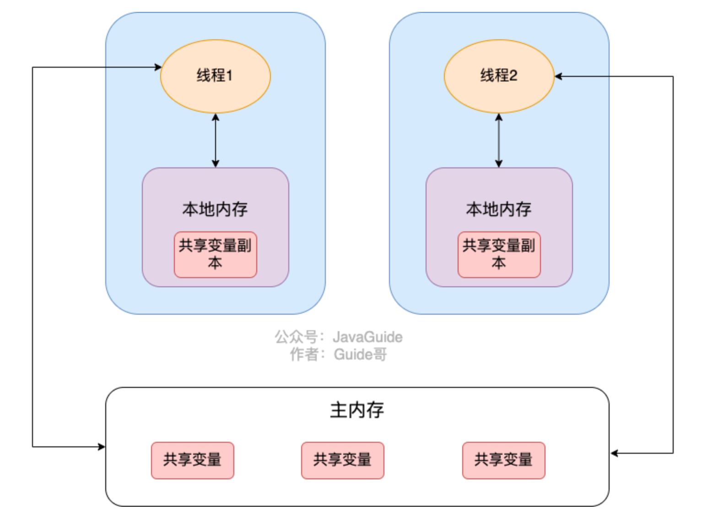

### 锁

##### 乐观锁与悲观锁思想

悲观锁总是假设最坏的情况，认为共享资源在访问的时候总是会出现问题，所以每次获取资源的时候都会上锁

synchronized和ReentrantLock等独占锁都属于悲观锁思想的思想，**在多写场景下使用**，避免频繁失败和重试

乐观锁假设最好的情况，认为共享资源每次访问都不会被出问题，无需加锁，只需要在**提交修改的时候验证**就好

JUC的原子类就是使用了乐观锁的一种实现CAS（Compare And Swap）实现的，用于读多写少的场景，避免频繁加锁影响性能，**但是CAS会自旋**

**但是乐观锁会存在ABA问题**，可以使用版本号或时间戳的方式解决

##### synchronized

在早期版本中称为重量级锁，因为依赖于底层操作系统的**Mutex Lock**实现，Java的线程映射到操作系统的线程上，如果要挂起或者唤醒一个线程，**需要系统调用切换内核态**

1.6之后引入了大量优化，如自旋锁、自适应自旋锁、锁消除、锁粗化、偏向锁、轻量级锁等，在JVM层面实现加锁的逻辑

底层实现：在编译为.class文件后查看字节码

**修饰代码块时可以看到实现是使用monitorenter和monitorexit指令**

**修饰方法时可以看到flags被设为ACC_SYNCHRONIZED**

锁可升级不可降级

##### 重量级锁

`synchronized`使用的锁就是存储在Java对象头中的

mutex，monitor对象，内核态和用户态的切换

jdk1.6之前，synchronized被称为重量级锁

##### 自旋锁

通过无限循环的方式，不断检测是否能够获取锁（赌单个线程占用锁的时间非常短）

但循环次数太多后会变成重量级锁

##### 偏向锁

当某个线程第一次获得锁时，如果接下来都没有其他线程获取此锁，则持有锁的线程不需要进行同步操作

在对象头的Mark Word记录线程ID，如果不相等，使用CAS尝试修改，如果修改成功则获取锁。如果CAS失败，说明有竞争，升级为轻量级锁（即当前线程想要把Mark Word的ID换成自己，如果换失败则升级为轻量级锁）

##### 轻量级锁

jdk1.6后引入轻量级锁，试图将Mark Word的指向到栈帧的LockRecord，CAS成功，则获取到轻量级锁。失败则自旋，自旋到**一定次数**则升级到重量级锁

#### 锁框架

无锁->偏向锁->轻量级锁->重量级锁 ；锁只有升级没有降级

##### **可重入锁 ReentrantLock**

可重入的独占锁，同一个线程可以反复进行加锁操作，getHoldCount()查看当前线程的加锁次数

还分公平锁和非公平锁，公平锁是线程按照申请锁的顺序去获得锁（有一个队列），非公平锁是抢

有一个内部类Sync，Sync继承了AQS，添加释放锁大部分操作都是在Sync中实现，Sync有FairSync和NonFairSynv两个子类，默认使用非公平锁，可以在构造方法里指定使用什么锁

##### **读写锁**

可重入锁是排它锁

- 读锁：在没有任何线程占用写锁的情况下，同一时间可以有多个线程加读锁。
- 写锁：在没有任何线程占用读锁的情况下，同一时间只能有一个线程加写锁。

ReentrantReadWriteLock

需要先获得读锁或者写锁，然后再进行锁操作

```java
ReentrantReadWriteLock lock = new ReentrantReadWriteLock();
lock.readLock().lock();
```

支持锁降级 不支持锁升级

##### **AQS AbstractQueuedSynchronizer 抽象队列同步器**

是实现锁机制的基础，内部封装包括锁的获取，释放，以及等待队列，提供了一些通用的事项

ReentrantLock、Semaphore等基于AQS

核心思想是，如果被请求的共享资源空闲，则将当前请求资源的线程设置为有效的工作线程，并且将共享资源设置为锁定状态，如果请求的资源被占用，需要有一套线程阻塞等待和被唤醒时锁分配的机制，这个机制使用CLH队列锁实现

CLH是一个虚拟的双向队列，AQS将每条请求共享资源的线程封装成CLH的一个节点

还维护了state状态变量

##### Semaphore信号量

有公平和非公平，创建的时候指定许可证数量

是共享锁的一种实现，

##### CountDownLatch

CountDownLatch允许多个线程阻塞在一个地方，直至所有线程的任务都执行完毕，一次性

每个线程执行完之后手动调用 `latch.countDown();`**主线程**调用await

基于AQS，其实就是把初始大小赋值为AQS的state；`countDown()`时state-1；await是判断state是否为0，自旋

##### CyclicBarrier

大家一起调用 **`barrier.await();`** 凑够初始化数了各个线程就不阻塞了

使用Reentrant+Condition实现

可重置来重复使用

### 原子类

底层采用CAS算法

JDK8后增加了LongAdder方法，原理是内部维护一个Cell[] as数组，每个Cell里面有一个初始值为0的long型变量，在高并发时会进行分散CAS，就是不同的线程可以对数组中不同的元素进行CAS自增，这样就避免了所有线程都对同一个值进行CAS，只需要最后再将结果加起来即可。

ABA问题：线程1把a的值从1设置为2又设置为1，对线程2来说，CAS操作成功，JUC提供带版本号的引用类型来解决

### 并发容器

CopyOnWriteArrayList添加操作时直接上锁，拷贝一份当前存放元素的数组，对数组进行修改后，将此数组替换（COW）

对读操作则不上锁

ConcurrentHashMap CAS+锁，添加元素时桶为空使用CAS，不为空给头结点用syn加锁

ArrayBlockingQueue 有界带缓冲阻塞队列（队列有容量限制，装满了不能再装）

SynchronousQueue 无缓冲阻塞队列 相当于没有容量的ArrayBlockingQueue，只有阻塞的情况 (put和get操作必须相对应)

LinkedBlockingQueue 无界带缓冲阻塞队列（无容量限制，也可以限制容量，链表实现）

### 线程池

使用Executor来创建新的线程池（各种方法以各种参数调用ThreadPoolExecutor）

`ThreadPoolExecutor`参数：

**corePoolSize**核心线程池大小，每向线程池提交任务时，会创建一个新的核心线程（无论是否存在其他空闲线程），当达到核心线程池大小后，会尝试复用线程资源

**maximumPoolSize** 最大线程池大小，当**目前线程池中所有的线程都处于运行状态**，**且等待队列已满**，会尝试创建新的非核心线程运行

keepAliveTime 当一个**非核心线程**空闲超过一定时间 会自动销毁

workQueue 线程等待队列，当线程池中核心线程数已满时，会将任务暂时存到等待队列中

RejectedExecutionHandler handler 饱和策略

线程建议设置大小：

* **CPU 密集型任务(N+1)：** 这种任务消耗的主要是 CPU 资源，可以将线程数设置为 N（CPU 核心数）+1。比 CPU 核心数多出来的一个线程是为了防止线程偶发的缺页中断，或者其它原因导致的任务暂停而带来的影响。一旦任务暂停，CPU 就会处于空闲状态，而在这种情况下多出来的一个线程就可以充分利用 CPU 的空闲时间。
* **I/O 密集型任务(2N)：** 这种任务应用起来，系统会用大部分的时间来处理 I/O 交互，而线程在处理 I/O 的时间段内不会占用 CPU 来处理，这时就可以将 CPU 交出给其它线程使用。因此在 I/O 密集型任务的应用中，我们可以多配置一些线程，具体的计算方法是 2N。

### Future泛型接口

异步思想，把耗时的任务交给子进程异步执行，然后可以去干别的事情，等事情干完后通过Future类获取执行结果

接口方法有取消、是否被取消、是否结束、获取任务结果

#### CompletableFuture

Future在实际使用中存在一些局限性，如不支持异步任务编排组合，获取计算结果的get为阻塞调用

CompletableFuture解决了这些缺陷

CompletableFuture泛型类型就是结果值类型，对对象调用complete方法并传入结果

isDone后get就好

### volatile (JMM)

当某个变量使用volatile修饰时，即对JVM表明该变量是**共享且不稳定**的，每次使用它都要去主内存中读取，而不是在线程中修改自己的副本（可以理解为禁止线程缓存）。

只能保证可见性，但不保证原子性，可以禁止指令重排序，保证之前的指令一定执行，之后的指令一定没执行


