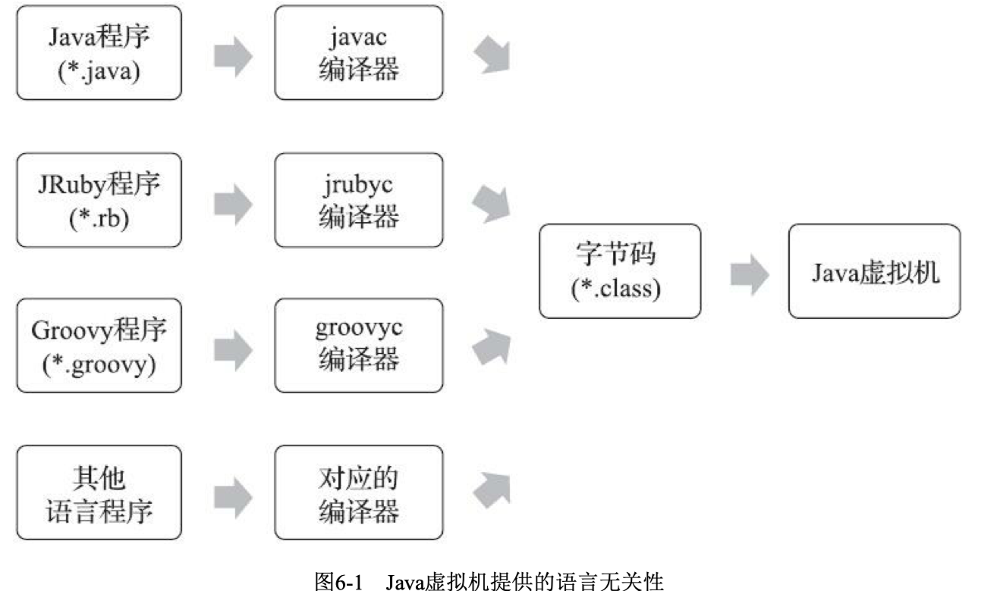
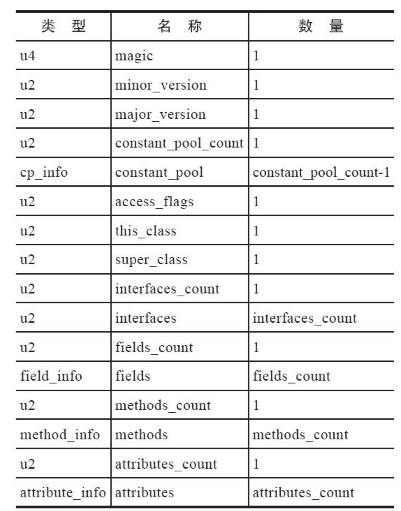
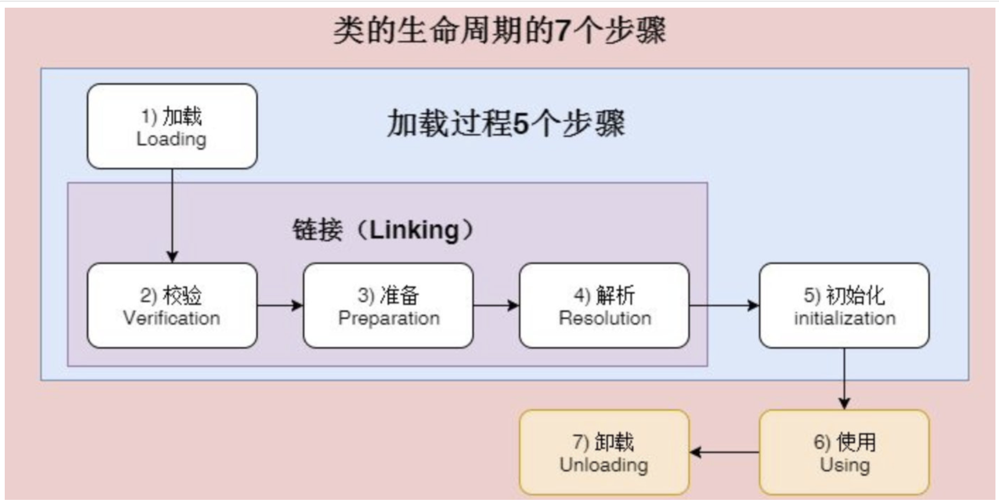

## Class文件结构

作为一个通用的、与机器无关的执行平台，任何其他语言的实现者都可以将Java虚拟机作为他们语言的运行基础，以Class文件作为他们产品 的交付媒介。例如，使用Java编译器可以把Java代码编译为存储字节码的Class文件，使用JRuby等其他 语言的编译器一样可以把它们的源程序代码编译成Class文件。虚拟机丝毫不关心Class的来源是什么语 言，它与程序语言之间的关系如图6-1所示。

任何一个Class文件都对应着唯一的一个类或接口的定义信息 [1] ，但是反过来说，类或 接口并不一定都得定义在文件里（譬如类或接口也可以动态生成，直接送入类加载器中）。本章中， 笔者只是通俗地将任意一个有效的类或接口所应当满足的格式称为“Class文件格式”，实际上它完全不 需要以磁盘文件的形式存在。

Class文件是一组以8个字节为基础单位的二进制流，各个数据项目严格按照顺序紧凑地排列在文 件之中，中间没有添加任何分隔符，这使得整个Class文件中存储的内容几乎全部是程序运行的必要数据，没有空隙存在。当遇到需要占用8个字节以上空间的数据项时，则会按照高位在前的方式分割成若干个8个字节进行存储。

无符号数属于基本的数据类型，以u1、u2、u4、u8来分别代表1个字节、2个字节、4个字节和8个 字节的无符号数，无符号数可以用来描述数字、索引引用、数量值或者按照UTF-8编码构成字符串 值。

#### 魔数（Magic Number）与版本号

它的唯一作用是确定这个文件是否为 一个能被虚拟机接受的Class文件，值为0xCAFEBABE

紧接着魔数的4个字节存储的是Class文件的版本号：第5和第6个字节是次版本号（Minor Version），第7和第8个字节是主版本号（Major Version）。Java的版本号是从45开始的，JDK 1.1之后 的每个JDK大版本发布主版本号向上加1（JDK 1.0～1.1使用了45.0～45.3的版本号），高版本的JDK能 向下兼容以前版本的Class文件，但不能运行以后版本的Class文件，因为《Java虚拟机规范》在Class文 件校验部分明确要求了即使文件格式并未发生任何变化，虚拟机也必须拒绝执行超过其版本号的Class 文件。

#### 常量池

Java代码在进行Javac编译的时候，并不像C和C++那样有“连接”这一步骤，而是在虚拟机加载Class 文件的时候进行动态连接（具体见第7章）。也就是说，在Class文件中不会保存各个方法、字段最终 在内存中的布局信息，这些字段、方法的符号引用不经过虚拟机在运行期转换的话是无法得到真正的内存入口地址，也就无法直接被虚拟机使用的。当虚拟机做类加载时，将会从常量池获得对应的符号 引用，再在类创建时或运行时解析、翻译到具体的内存地址之中。

## 类加载阶段

Java启动时，JVM会将一部分class文件先加载（并不是所有类都会在一开始加载），在加载的过程中，会把类的信息提出存放在元空间（1.8以前放在永久代），同时生成一个Class对象存放在堆内存，此Class对象只会存在一个，与加载的类唯一对应

如果这些时候类没有被加载，则会自动加载：

- 使用new关键字创建对象时
- 使用某个类的静态成员（包括方法和字段）
- 使用反射对类信息进行获取时（数据库驱动）
- 加载类的子类
- 加载接口的实现类，且接口带有default的方法默认实现时

#### 加载

获取此类的二进制数据流，交给类加载器加载

将类的字节码载入到**方法区**，在堆内存中会生成一个代表该类的Class对象，可以通过此对象以及反射机制访问这个类的信息

#### 验证

检查类是否符合JVM标准：魔数，版本号，class文件各个部分完整性如何

#### 准备

为变量分配内存，设定系统初始值

#### 解析

将常量池内的符号引用替换为直接引用（把引用变量指向内存中的对象）

#### 初始化

执行类中编写的Java代码，静态成员静态代码块等

## 类加载器

任意一个类，需要由加载它的类加载器和这个类本身来确定其在JVM中的唯一性

即不同类加载器加载出的类也是不同的

**双亲委派机制**

通过委派的方式，可以避免类的重复加载（父加载过的子不会加载），还可以保证安全性（防止别人自定义一个破坏性的Integer等）

*loadClass()*进行类加载的方法，默认的双亲委派机制放在此方法中

*findClass()* 根据名称或位置加载.class字节码

*defineClass()*把字节码转位Class

Tomcat破坏双亲委派的原因：

不同的应用程序可能会依赖同一个第三方类库的不同版本，但不同版本类库中某一个类的全路径名可能实现相同的，采用默认的双亲委派机制，这无法加载多个相同的类。Tomcat破坏了双亲委派机制，提供隔离，为每个web容器提供一个WebAppClassLoader

## 双亲委派机制

自定义一个实现了ClassLoader接口的类，override它的loadclass方法（不提倡）

不想破坏双亲委派机制的时候就override它的findclass方法
