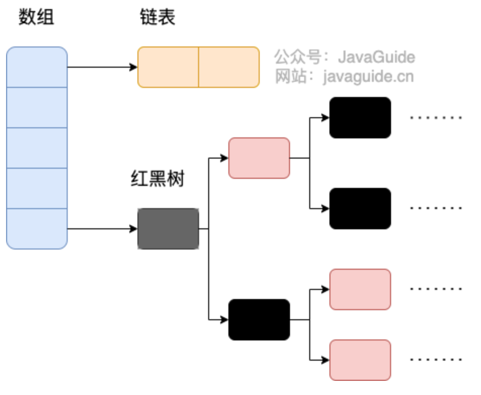

## List
#### ArrayList 与 LinkedList 的区别


#### ArrayList扩容方法


## Set

HashSet底层是哈希表（基于HashMap），LinkedHashSet底层是链表和哈希表，TreeSet底层是红黑树

HashSet源码较为简单，大部分都是直接调用HashMap的方法

集合去重时应该使用Set而不是contains()方法，可以大大缩短时间复杂度


## Queue

#### ArrayDeque ArrayList区别


#### PriorityQueue


## Map

#### TreeMap

TreeMap实现了NavigableMap接口和SortedMap接口


#### HashMap初始大小、扩容机制

JDK8之前，是使用数组+链表组合，通过key的hashcode经过扰动获得hash值，再通过(n-1) & hash（n为数组长度）判断存放位置，使用拉链法解决冲突

**当n为2的次方时，hash%length==hash&(length-1)，所以HashMap的长度为2的次方**

JDK8之后，当链表长度大于阈值（默认为8）时，将链表转化为红黑树，（将链表转换成红黑树前会判断，如果当前数组的长度小于 64，那么会选择先进行数组扩容，而不是转换为红黑树）



容量初始为16，每次扩充会变为原来两倍

源码中的hash方法：

```java
static final int hash(Object key) {
        int h;
        return (key == null) ? 0 : (h = key.hashCode()) ^ (h >>> 16);
    }
```


#### HashMap遍历方式


#### HashMap、Hashtable和ConcurrentHashMap区别

Hashtable基本被淘汰

HashTable和ConcurrentHashMap都是线程安全的，


## 杂项
#### comparable与Comparator区别
`comparable` 接口实际上是出自`java.lang`包 它有一个 `compareTo(Object obj)`方法用来排序
`comparator`接口实际上是出自 `java.util` 包它有一个`compare(Object obj1, Object obj2)`方法用来排序


#### RandomAccess接口
该接口为空，仅做标记用，如在binarysearch()中，判断传入的参数是否为RandomAccess的实例，根据判断结果选择不同的方法
