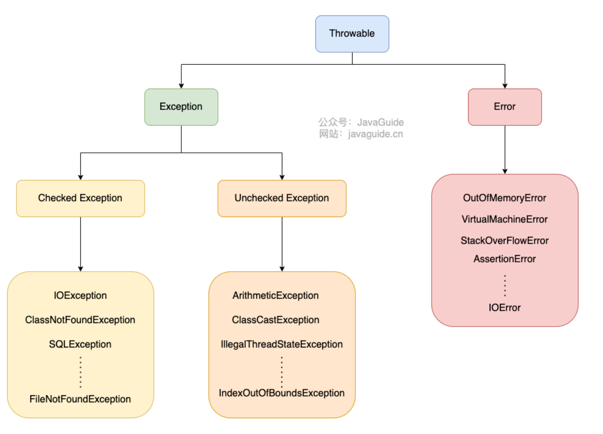
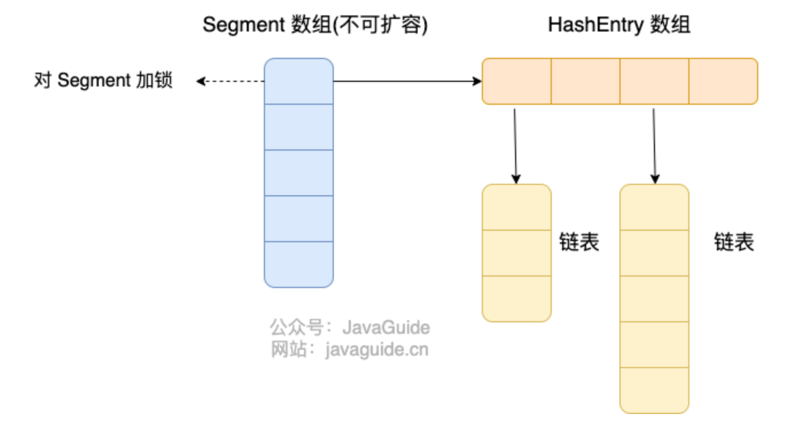

##### **什么是字节码？**

java/scala/kotlin/groovy编译后的.class文件即是字节码，JVM解释器和JIT**解释**字节码并转换为机器码

JIT把编译后的部分机器码保留下来

##### C++和Java区别

Java不提供指针来直接操作内存，创建直接内存得用UnSafe类，而且这个类也不是给大家用的

C++有指针，malloc，free等

Java只支持单继承，但可以实现多个接口。C++支持多重继承

Java有垃圾回收GC

C++支持方法重载和运算符重载，Java只支持方法重载

##### 基本类型和包装类型的区别

包装类不赋值为null，基本类型不赋值有初始值

泛型只可以用包装类

基本类型的局部变量放在JVM的虚拟机栈的局部变量表里，基本类型的成员变量放在堆里。包装类型基本都放在堆里

基本类型占用空间非常小

##### 包装类型缓存机制

`Byte`,`Short`,`Integer`,`Long` 这 4 种包装类默认创建了数值 **[-128，127]** 的相应类型的缓存数据，调用valueOf的时候返回缓存的内容，new Integer时是创建新的对象

##### 自动装拆箱

从字节码中分析，其实就是自动调用了包装类的 `valueOf()`方法，拆箱时是调用了 `intValue()`

频繁拆装箱影响性能

##### 面向对象

面向对象会先抽象出对象，然后用对象执行方法的方式来解决问题

三大特性是封装、继承、多态

多态的具体表现为父类的引用指向子类的实例

##### 接口和抽象类区别

相同点：都不可以被实例化，都可以有抽象方法和默认实现方法

不同点：接口是对类的行为进行约束，实现了接口需要有对应的行为；抽象类主要用于代码复用

Java单继承，但可以实现多个接口

接口中的成员变量是 `public static final`；而抽象类的成员变量默认default

##### 引用拷贝、浅拷贝、深拷贝

浅拷贝也会在堆里创建一个新对象，如果原对象**内部的属性**是**引用类型**的话，浅拷贝会直接复制内部对象的引用地址，也就是说拷贝对象和原对象共用同一个内部对象。

##### ==和equals区别

对基本类型来说，==是比较值；但对引用类型来说，==比较的是内存地址

**重写equals方法时必须重写hashcode方法**

##### String、StringBuilder与StringBuffer

String是不可变的，类内部保存字符的数组使用final关键字修饰，且不提供接口修改，String类也被final修饰，无法创建子类

StringBuffer加了同步锁，是线程安全的

StringBuilder是非线程安全的

一般来说，字符串"+"，在编译为字节码的时候JVM也会自动创建StringBuilder，但是如果在循环里"+"，就会创建特别多的StringBuilder

##### 字符串常量池/intern()

字符串常量池在堆里

调用intern方法时：

* 如果字符串常量池有有对应引用，则返回该引用
* 如果没有，则在字符串常量池中创建一个指向该字符串对象的引用并返回

##### 异常结构

##### Error和Exception区别

所有异常的父类是Throwable类，Exception类是可以处理的异常，Error类是程序无法处理的错误（OOM，类定义错误等，断言错误，StackOverFlowError）

Checked Exception（受检查异常）如果没有被catch的话，就无法通过编译

Unchecked Exception：RuntimeException及其子类都称为非受检查异常：如

* `NullPointerException`(空指针错误)
* `IllegalArgumentException`(参数错误比如方法入参类型错误)
* `NumberFormatException`（字符串转换为数字格式错误，`IllegalArgumentException`的子类）
* `ArrayIndexOutOfBoundsException`（数组越界错误）
* `ClassCastException`（类型转换错误）
* `ArithmeticException`（算术错误）

##### 静态代理/动态代理

**静态代理实现步骤：**

1. 定义一个接口和它的实现类
2. 创建一个代理类同样实现这个接口
3. 将目标对象注入代理类，然后在代理类对应方法中调用目标类的对应方法

静态代理对每个方法的加强都是手动完成的；**接口增加新方法，目标对象和代理类都需要修改**，而且需要对每个目标类都单独写一个代理类

动态代理是在运行时动态生成类字节码，加载到JVM中

**Java动态代理：**

使用了反射

* 定义一个接口及其实现类
* 定义一个实现了InvocationHandler接口的方法并重写invoke方法，在invoke方法中调用原生方法并自定义一些逻辑
* 通过Proxy.newProxyInstance创建代理对象

**CGLIB动态代理**

基于ASM的字节码生成库

JDK动态代理只能代理实现了接口的类，CGLIB可以代理未实现任何接口的类

##### 反射与泛型擦除

泛型的信息只存在于编译阶段，到class文件就看不到泛型信息了，但定义在类上的泛型信息不会被擦除

##### 线程安全

保证操作原子性，可以用atomic包下面的原子类；保证可见性，用volatile，涉及对线程的控制用CountDownLatch和Semaphone；集合使用JUC包下面的集合类；如果synChronized无法满足，则使用lock包下面的类

### 容器

##### comparable 和 Comparator 的区别

##### HashMap底层实现(1.8/1.7)

1.8以前是数组+链表

1.8后，当链表长度大于阈值（默认为8），则会把链表转换为红黑树（但如果当前数组的长度小于64，则会优先对数组扩容）

##### 为什么HashMap数组的长度一定为2的幂次方

在hash之后要对数组的长度进行取模，这个数组下标的计算方法是(n-1)&hash

如果len是2的幂次方，**hash%length==hash&(length-1)**

#### 并发容器

##### ConcurrentHashMap

1.7之前，ConcurrentHashMap对桶数组进行分段，每一把锁只锁容器中一部分数据，多线程访问不同分段中的数据时不会有竞争，Segment的个数一旦初始化就不能改变，默认大小是16

1.8之后是使用Node数组+链表+红黑树实现，并发控制使用synchronized和CAS操作，锁粒度更细

不同之处在于 线程安全的实现方式、并发数、哈希碰撞解决方案

##### CopyOnWriteArrayList

读取完全不加锁，add时有锁

### 并发与JUC

##### 公平锁和非公平锁有什么差别

公平锁在锁释放后，先申请的的线程先得到锁，性能差一点，为保证时间上的绝对顺序，上下文切换更频繁

非公平锁在锁释放后，后面的线程是按照随机或者优先级来获得锁，性能好，但有些线程可能永远无法获得锁

##### synchronized 和 ReentrantLock 有什么区别？

都是可重入锁

synchronized依赖JVM，ReentrantLock依赖API

ReentrantLock增加了一些高级功能

##### ReentrantReadWriteLock与StampedLock

ReentrantReadWriteLock实际用的较少，1.8后引入了更好的读写锁StampedLock

ReentrantReadWriteLock是一个可重入的读写锁

不可以在持有读锁的情况下获取写锁

持有写锁的情况下可以继续获取读锁

StampedLock不可重入且不支持Condition。支持一个**乐观读**，允许多个线程获取乐观锁与读锁，同时允许一个写线程获取写锁，适合读多写少的原因

##### ThreadLocal

提供了线程的局部变量

内部使用ThreadLocalMap来存放对象，有多个ThreadLocal就对应Map里的多个对象

**内存泄露？**

##### 线程池

* 降低资源消耗，避免不断创建和销毁线程
* 提高响应速度
* 提高线程的可管理性

**`ThreadPoolExecutor`来创建，或者使用 `Executors`预定义好的来使用**
