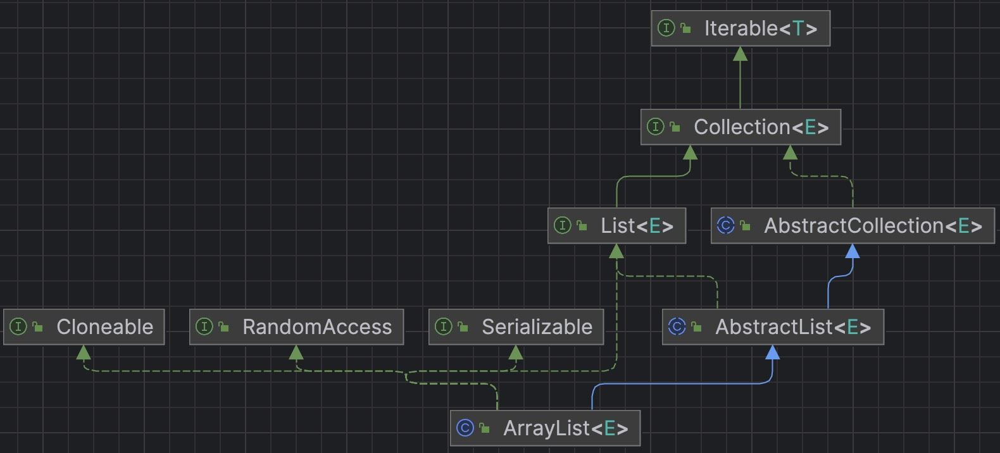

# ArrayList相关知识与源码阅读



* ArrayList底层使用 `Object[]`存储，允许null值
* 当指定容量为0时，指向的时一个 `static final Object[] EMPTY_ELEMENTDATA={}`用于共享；

* 当初始化一个默认大小的ArrayList且不赋初始值时，指向的时 `static final Object[] DEFAULTCAPACITY_EMPTY_ELEMENTDATA = {};`用于共享

*下方ArrayList源码基于JDK17*

## 定义

ArrayList位于java.util包下面，继承自AbstractList类，实现 `List<E>, RandomAccess, Cloneable, java.io.Serializable`接口，所以支持随机访问、复制、序列化。

```java
package java.util;

import java.util.function.Consumer;
import java.util.function.Predicate;
import java.util.function.UnaryOperator;
import jdk.internal.access.SharedSecrets;
import jdk.internal.util.ArraysSupport;


public class ArrayList<E> extends AbstractList<E>
        implements List<E>, RandomAccess, Cloneable, java.io.Serializable
```

## 类成员对象

```java
@java.io.Serial
private static final long serialVersionUID = 8683452581122892189L

/**
 * 初始默认容量
 */
private static final int DEFAULT_CAPACITY = 10

/**
 * 静态共享的容量为空的队列实例（容量为0时的实例）
 */
private static final Object[] EMPTY_ELEMENTDATA = {};

/**
 * 静态共享的空队列实例（容量为默认值，但尚未添加元素的队列实例）
 */
private static final Object[] DEFAULTCAPACITY_EMPTY_ELEMENTDATA = {};

/**
 * 实际存储元素的数组
 */
transient Object[] elementData; // non-private to simplify nested class access

/**
 * 实际存储的元素的数量
 */
private int size;
```

modcount变量是定义在 AbstractList 中的。记录对 List 操作的次数。主要使用是在 Iterator，是防止在迭代的过程中集合被修改。

```java
protected transient int modCount = 0;
```

## ArrayList构造函数

```java
    /**
     * 以指定大小初始化容量，指定大小大于0时，分配对象数组；等于0时指向EMPTY_ELEMENTDATA；否则抛出异常
     */
   public ArrayList(int initialCapacity) {
        if (initialCapacity > 0) {
            this.elementData = new Object[initialCapacity];
        } else if (initialCapacity == 0) {
            this.elementData = EMPTY_ELEMENTDATA;
        } else {
            throw new IllegalArgumentException("Illegal Capacity: "+
                                               initialCapacity);
        }
    }
  

    /**
     * 默认空的初始化构造函数，指向DEFAULTCAPACITY_EMPTY_ELEMENTDATA
     */
    public ArrayList() {
        this.elementData = DEFAULTCAPACITY_EMPTY_ELEMENTDATA;
    }

    /**
     * 使用一个集合来构造这个ArrayList
     */
    public ArrayList(Collection<? extends E> c) {
      	// 把c的内容转换成Object数组先
        Object[] a = c.toArray();
        if ((size = a.length) != 0) {
          	// 如果传入的是ArrayList，直接赋值即可
            if (c.getClass() == ArrayList.class) {
                elementData = a;
            } else {
              //否则需要复制
                elementData = Arrays.copyOf(a, size, Object[].class);
            }
        } else {
            // 如果传入的集合长度为0，直接指向EMPTY_ELEMENTDATA
            elementData = EMPTY_ELEMENTDATA;
        }
    }

```

## 扩容机制

默认初始大小为10，但当使用无参构造创建ArrayList时，是创建一个空数组，当对数组添加元素时才真正分配容量

每次期望增长到原来的1.5倍（oldCapacity >> 1）

```java
    /**
     * minCapacity是所期望的最小容量
     * 如果所期望容量大于当前数组的长度，且不是初始状态，则增长容量
     */
    public void ensureCapacity(int minCapacity) {
        if (minCapacity > elementData.length
            && !(elementData == DEFAULTCAPACITY_EMPTY_ELEMENTDATA
                 && minCapacity <= DEFAULT_CAPACITY)) {
            modCount++;
            grow(minCapacity);
        }
    }

    /**
     * 如果现在List里是空的，则分配默认容量和minCapacity较大值的空间
     * 否则扩容为1.5倍（传入旧容量，最少增长容量，和期望增长容量）
     * 期望增长容量是旧容量右移一位，故为原来的0.5倍
     */
    private Object[] grow(int minCapacity) {
        int oldCapacity = elementData.length;
        if (oldCapacity > 0 || elementData != DEFAULTCAPACITY_EMPTY_ELEMENTDATA) {
            int newCapacity = ArraysSupport.newLength(oldCapacity,
                    minCapacity - oldCapacity, /* minimum growth */
                    oldCapacity >> 1           /* preferred growth */);
            return elementData = Arrays.copyOf(elementData, newCapacity);
        } else {
            return elementData = new Object[Math.max(DEFAULT_CAPACITY, minCapacity)];
        }
    }

    private Object[] grow() {
        return grow(size + 1);
    }
```

ArraysSupport.newLength方法：

```java
public static final int SOFT_MAX_ARRAY_LENGTH = Integer.MAX_VALUE - 8;

public static int newLength(int oldLength, int minGrowth, int prefGrowth) {
    // preconditions not checked because of inlining
    // assert oldLength >= 0
    // assert minGrowth > 0

    int prefLength = oldLength + Math.max(minGrowth, prefGrowth); // might overflow
    if (0 < prefLength && prefLength <= SOFT_MAX_ARRAY_LENGTH) {
        return prefLength;
    } else {
        // put code cold in a separate method
        return hugeLength(oldLength, minGrowth);
    }
}
```

## 添加/删除元素

```java

    // 获取对应下标的元素
    @SuppressWarnings("unchecked")
    E elementData(int index) {
        return (E) elementData[index];
    }

    /**
     * 检查下标成功后即可直接返回对应元素
     */
    public E get(int index) {
        Objects.checkIndex(index, size);
        return elementData(index);
    }

    /**
     * 检查下标后备份原数据，修改后返回原数据
     */
    public E set(int index, E element) {
        Objects.checkIndex(index, size);
        E oldValue = elementData(index);
        elementData[index] = element;
        return oldValue;
    }

    /**
     * This helper method split out from add(E) to keep method
     * bytecode size under 35 (the -XX:MaxInlineSize default value),
     * which helps when add(E) is called in a C1-compiled loop.
     */
    private void add(E e, Object[] elementData, int s) {
        if (s == elementData.length)
            elementData = grow();
        elementData[s] = e;
        size = s + 1;
    }

    /**
     * 调用指定位置的add方法，指定插入点为尾部
     */
    public boolean add(E e) {
        modCount++;
        add(e, elementData, size);
        return true;
    }

    public void add(int index, E element) {
        rangeCheckForAdd(index);
        modCount++;
        final int s;
        Object[] elementData;
        if ((s = size) == (elementData = this.elementData).length)
            elementData = grow();
        System.arraycopy(elementData, index,
                         elementData, index + 1,
                         s - index);
        elementData[index] = element;
        size = s + 1;
    }

    /**
     * 检查索引位置正确后，调用fastRemove方法
     */
    public E remove(int index) {
        Objects.checkIndex(index, size);
        final Object[] es = elementData;

        @SuppressWarnings("unchecked") E oldValue = (E) es[index];
        fastRemove(es, index);

        return oldValue;
    }

    public boolean equals(Object o) {
        if (o == this) {
            return true;
        }

        if (!(o instanceof List)) {
            return false;
        }

        final int expectedModCount = modCount;
        // 根据传入的对象是否为ArrayList来调用不同的比较函数
        boolean equal = (o.getClass() == ArrayList.class)
            ? equalsArrayList((ArrayList<?>) o)
            : equalsRange((List<?>) o, 0, size);

        checkForComodification(expectedModCount);
        return equal;
    }

    /**
     * 找到之后调用fastRemove方法并return true，否则return false
     */
    public boolean remove(Object o) {
        final Object[] es = elementData;
        final int size = this.size;
        int i = 0;
        found: {
            if (o == null) {
                for (; i < size; i++)
                    if (es[i] == null)
                        break found;
            } else {
                for (; i < size; i++)
                    if (o.equals(es[i]))
                        break found;
            }
            return false;
        }
        fastRemove(es, i);
        return true;
    }
```

## 其余常用方法

```java
    /**
     * 把列表修剪成含有元素的大小
     */
    public void trimToSize() {
        modCount++;
        if (size < elementData.length) {
            elementData = (size == 0)// 如果长度为0则指向EMPTY_ELEMENTDATA，否则复制一份已有元素大小的并指向它
              ? EMPTY_ELEMENTDATA
              : Arrays.copyOf(elementData, size);
        }
    }

    public int size() {
        return size;
    }

    public boolean isEmpty() {
        return size == 0;
    }

    /**
     * 直接调用contains方法
     */
    public boolean contains(Object o) {
        return indexOf(o) >= 0;
    }


    public int indexOf(Object o) {
        return indexOfRange(o, 0, size);
    }

    int indexOfRange(Object o, int start, int end) {
        Object[] es = elementData;
        // ArrayList允许null值
        if (o == null) {
            for (int i = start; i < end; i++) {
                if (es[i] == null) {
                    return i;
                }
            }
        } else {
            for (int i = start; i < end; i++) {
                if (o.equals(es[i])) {//使用equals判断是否相等
                    return i;
                }
            }
        }
        return -1;
    }

    /**
     * 返回一个copy
     */
    public Object[] toArray() {
        return Arrays.copyOf(elementData, size);
    }

    @Override
    @SuppressWarnings("unchecked")
    public void sort(Comparator<? super E> c) {
        final int expectedModCount = modCount;
        Arrays.sort((E[]) elementData, 0, size, c);
        if (modCount != expectedModCount)
            throw new ConcurrentModificationException();
        modCount++;
    }
```
