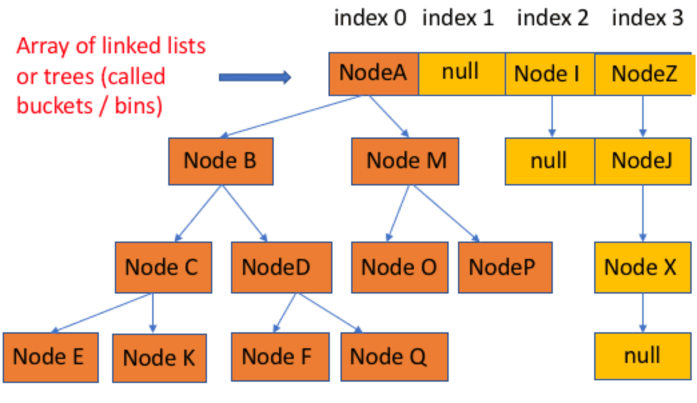

## HashMap相关知识与源码阅读

HashMap底层使用数组（桶）+链表/红黑树实现



- 负载因子默认为0.75，默认大小为16，故此时当Map中的容量超过12时，需要扩容，每次扩容是扩一倍
- HashMap中table的长度必须是2的幂次。因为当b为2的幂次时，存在：`a % b = a & (b-1)`
- 官方注释：树节点大概是普通节点的2倍大。
- 理想的情况下，在经过hashCode后，bins中Node的分布呈泊松分布，选取threshold为0.75，泊松分布中的概率参数λ=0.5，此时，链表长度为8的发生概率为0.00000006
- 当链表长度超过8时，且哈希表长度大于等于64时，会将桶里的链表转为红黑树。否则会优先扩容。
- 可以存在一个为null的key

## 定义

HashMap继承自AbstractMap，实现了Map、Cloneable、Serializable接口

```java
package java.util;

import java.io.IOException;
import java.io.InvalidObjectException;
import java.io.ObjectInputStream;
import java.io.Serializable;
import java.lang.reflect.ParameterizedType;
import java.lang.reflect.Type;
import java.util.function.BiConsumer;
import java.util.function.BiFunction;
import java.util.function.Consumer;
import java.util.function.Function;
import jdk.internal.access.SharedSecrets;

public class HashMap<K,V> extends AbstractMap<K,V>
    implements Map<K,V>, Cloneable, Serializable {
```

## 类成员对象

```java
@java.io.Serial
private static final long serialVersionUID = 362498820763181265L;

static final int DEFAULT_INITIAL_CAPACITY = 1 << 4; // 默认容量（数组长度） aka 16

static final int MAXIMUM_CAPACITY = 1 << 30; //最大容量，必须得是2的次方

static final float DEFAULT_LOAD_FACTOR = 0.75f; // 默认负载因子，0.75

static final int TREEIFY_THRESHOLD = 8; // 每一个bin由链表转为树的阈值

static final int UNTREEIFY_THRESHOLD = 6; // 每一个bin由树转为链表的阈值

//The smallest table capacity for which bins may be treeified. (Otherwise the table is resized if too many nodes in a bin.)
static final int MIN_TREEIFY_CAPACITY = 64; // bin中数据结构转换为红黑树的table最小容量


transient Node<K,V>[] table; //实际存放数据的table，容量总为2的幂次

transient Set<Map.Entry<K,V>> entrySet; //保留缓存的entrySet，实际存放键值对的

transient int size; //具体元素（键值对）的个数

transient int modCount; //总修改次数

int threshold; // 容量*填充因子，实际大小超过临界值时会扩容

final float loadFactor;
```

**threshold = capacity * loadFactor** ，当size>threhold，就需要扩容，进行rehash、重新分布数据等操作

默认容量为16，负载因子为0.75f，所以当数量到了12之后就需要扩容

## 元素存储

```java
//使用链表时候的Node，继承自Map.Entry<K,V>
static class Node<K,V> implements Map.Entry<K,V> {
        final int hash;
        final K key;
        V value;
  			// 指向下一个节点
        Node<K,V> next;

        Node(int hash, K key, V value, Node<K,V> next) {
            this.hash = hash;
            this.key = key;
            this.value = value;
            this.next = next;
        }

        public final K getKey()        { return key; }
        public final V getValue()      { return value; }
        public final String toString() { return key + "=" + value; }
				// 重写hashCode方法
        public final int hashCode() {
            return Objects.hashCode(key) ^ Objects.hashCode(value);
        }

        public final V setValue(V newValue) {
            V oldValue = value;
            value = newValue;
            return oldValue;
        }

        public final boolean equals(Object o) {
            if (o == this)
                return true;
						// 同样是Map.Entry时，键指是否都相等
            return o instanceof Map.Entry<?, ?> e
                    && Objects.equals(key, e.getKey())
                    && Objects.equals(value, e.getValue());
        }
    }
```

## 构造方法

```java
		//默认构造方法
		public HashMap() {
        this.loadFactor = DEFAULT_LOAD_FACTOR; // all other fields defaulted
    }

		// 指定初始容量的构造方法
		public HashMap(int initialCapacity) {
        this(initialCapacity, DEFAULT_LOAD_FACTOR);
    }

		public HashMap(int initialCapacity, float loadFactor) {
        if (initialCapacity < 0)
            throw new IllegalArgumentException("Illegal initial capacity: " +
                                               initialCapacity);
        if (initialCapacity > MAXIMUM_CAPACITY)
            initialCapacity = MAXIMUM_CAPACITY;
        if (loadFactor <= 0 || Float.isNaN(loadFactor))
            throw new IllegalArgumentException("Illegal load factor: " +
                                               loadFactor);
        this.loadFactor = loadFactor;
        this.threshold = tableSizeFor(initialCapacity);
    }
  
    public HashMap(Map<? extends K, ? extends V> m) {
        this.loadFactor = DEFAULT_LOAD_FACTOR;
        putMapEntries(m, false);
    }
```

## 添加元素

把另一个Map中的内容添加到本Map中：

```java
		final void putMapEntries(Map<? extends K, ? extends V> m, boolean evict) {
        int s = m.size();
        if (s > 0) {
          	// 如果还没初始化
            if (table == null) { // pre-size
                float ft = ((float)s / loadFactor) + 1.0F;
                int t = ((ft < (float)MAXIMUM_CAPACITY) ?
                         (int)ft : MAXIMUM_CAPACITY);
              	// 设定合适的threshold
                if (t > threshold)
                    threshold = tableSizeFor(t);
            } else {
                // Because of linked-list bucket constraints, we cannot
                // expand all at once, but can reduce total resize
                // effort by repeated doubling now vs later
              	// 当m的元素数量大于本Map的threshold，需要扩容处理
                while (s > threshold && table.length < MAXIMUM_CAPACITY)
                    resize();
            }
						// 将m中的元素添加到本Map中
            for (Map.Entry<? extends K, ? extends V> e : m.entrySet()) {
                K key = e.getKey();
                V value = e.getValue();
                putVal(hash(key), key, value, false, evict);
            }
        }
    }
```

put方法：

```java
		public V put(K key, V value) {
        return putVal(hash(key), key, value, false, true);
    }

    /**
     * Implements Map.put and related methods.
     *
     * @param hash hash for key
     * @param key the key
     * @param value the value to put
     * @param onlyIfAbsent if true, don't change existing value
     * @param evict if false, the table is in creation mode.
     * @return previous value, or null if none
     */
    final V putVal(int hash, K key, V value, boolean onlyIfAbsent,
                   boolean evict) {
        Node<K,V>[] tab; Node<K,V> p; int n, i;
      	// 如果本map尚未初始化，要先扩容
        if ((tab = table) == null || (n = tab.length) == 0)
            n = (tab = resize()).length;
      	// 当哈希表的table长度固定为2的幂次时，(n - 1) & hash 相当于 n % hash，确定元素放在哪个桶中
      	// 如果当前桶还为null时
        if ((p = tab[i = (n - 1) & hash]) == null)
            tab[i] = newNode(hash, key, value, null);
      	// 当前桶中已经有Node了，需要遍历
        else {
            Node<K,V> e; K k;
          	// 如果当前桶里的元素与插入值一样，
            if (p.hash == hash &&
                ((k = p.key) == key || (key != null && key.equals(k))))
                e = p;
          	// 桶中当前节点为红黑树
            else if (p instanceof TreeNode)
                e = ((TreeNode<K,V>)p).putTreeVal(this, tab, hash, key, value);
            else {
                for (int binCount = 0; ; ++binCount) {
                  	// 遍历到了结尾，没有找到相同key的Node
                    if ((e = p.next) == null) {
                        p.next = newNode(hash, key, value, null);
                      	// 链表长度大于了TREEIFY_THRESHOLD，考虑是否要转为红黑树（当数组长度小于64时优先扩容）
                        if (binCount >= TREEIFY_THRESHOLD - 1) // -1 for 1st
                            treeifyBin(tab, hash);
                        break;
                    }
                  	// 链表中找到相同key的元素
                    if (e.hash == hash &&
                        ((k = e.key) == key || (key != null && key.equals(k))))
                        break;
                    p = e;
                }
            }
          	// Map中已经存有相同key的元素了
            if (e != null) { // existing mapping for key
                V oldValue = e.value;
                if (!onlyIfAbsent || oldValue == null)
                  	// 替换value
                    e.value = value;
                afterNodeAccess(e);
                return oldValue;
            }
        }
        ++modCount;
        if (++size > threshold)
            resize();
        afterNodeInsertion(evict);
        return null;
    }
```

## 获取元素

```java
	public V get(Object key) {
        Node<K,V> e;
        return (e = getNode(key)) == null ? null : e.value;
    }

    /**
     * Implements Map.get and related methods.
     *
     * @param key the key
     * @return the node, or null if none
     */
    final Node<K,V> getNode(Object key) {
        Node<K,V>[] tab; Node<K,V> first, e; int n, hash; K k;
      	// table不为空，且对应桶里有东西
        if ((tab = table) != null && (n = tab.length) > 0 &&
            (first = tab[(n - 1) & (hash = hash(key))]) != null) {
          	// 查下第一个节点先
            if (first.hash == hash && // always check first node
                ((k = first.key) == key || (key != null && key.equals(k))))
                return first;
            if ((e = first.next) != null) {
              	// 在红黑树里找
                if (first instanceof TreeNode)
                    return ((TreeNode<K,V>)first).getTreeNode(hash, key);
              	// 链表遍历查找
                do {
                    if (e.hash == hash &&
                        ((k = e.key) == key || (key != null && key.equals(k))))
                        return e;
                } while ((e = e.next) != null);
            }
        }
        return null;
    }
```

## hash方法

```java
		static final int hash(Object key) {
        int h;
        return (key == null) ? 0 : (h = key.hashCode()) ^ (h >>> 16);
    }
```

首先，h右移16位之后前面16位全为0。混合了原来哈希值的高位和低位，低位的随机性加大了

## resize方法

当链表长度大于阈值（默认为 8）时，会首先调用 `treeifyBin()`方法。这个方法会根据 HashMap 数组来决定是否转换为红黑树。只有当数组长度大于或者等于 64 的情况下，才会执行转换红黑树操作，以减少搜索时间。否则，就是只是执行 `resize()` 方法对数组扩容。

```java
	final Node<K,V>[] resize() {
        Node<K,V>[] oldTab = table;
    		// table原长度
        int oldCap = (oldTab == null) ? 0 : oldTab.length;
        int oldThr = threshold;
        int newCap, newThr = 0;
        if (oldCap > 0) {
          	// 如果容量已经超过最大值，不再扩充
            if (oldCap >= MAXIMUM_CAPACITY) {
                threshold = Integer.MAX_VALUE;
                return oldTab;
            }
          	// 否则把容量扩充一倍，threshold也扩一倍
            else if ((newCap = oldCap << 1) < MAXIMUM_CAPACITY &&
                     oldCap >= DEFAULT_INITIAL_CAPACITY)
                newThr = oldThr << 1; // double threshold
        }
    		// table.length==0的情况
        else if (oldThr > 0) // initial capacity was placed in threshold
            newCap = oldThr;
    		// 计算一下默认情况
        else {               // zero initial threshold signifies using defaults
            newCap = DEFAULT_INITIAL_CAPACITY;
            newThr = (int)(DEFAULT_LOAD_FACTOR * DEFAULT_INITIAL_CAPACITY);
        }
        if (newThr == 0) {
            float ft = (float)newCap * loadFactor;
            newThr = (newCap < MAXIMUM_CAPACITY && ft < (float)MAXIMUM_CAPACITY ?
                      (int)ft : Integer.MAX_VALUE);
        }
        threshold = newThr;
        @SuppressWarnings({"rawtypes","unchecked"})
    		// 新的table，数组长度为newCap
        Node<K,V>[] newTab = (Node<K,V>[])new Node[newCap];
        table = newTab;
        if (oldTab != null) {
         		// 数组遍历
            for (int j = 0; j < oldCap; ++j) {
                Node<K,V> e;
                if ((e = oldTab[j]) != null) {
                    oldTab[j] = null;
                  	// 桶里只有这一个节点
                    if (e.next == null)
                        newTab[e.hash & (newCap - 1)] = e;
                    else if (e instanceof TreeNode)
                        ((TreeNode<K,V>)e).split(this, newTab, j, oldCap);
                    else { // preserve order
                        Node<K,V> loHead = null, loTail = null;
                        Node<K,V> hiHead = null, hiTail = null;
                        Node<K,V> next;
                        do {
                            next = e.next;
                            if ((e.hash & oldCap) == 0) {
                                if (loTail == null)
                                    loHead = e;
                                else
                                    loTail.next = e;
                                loTail = e;
                            }
                            else {
                                if (hiTail == null)
                                    hiHead = e;
                                else
                                    hiTail.next = e;
                                hiTail = e;
                            }
                        } while ((e = next) != null);
                        if (loTail != null) {
                            loTail.next = null;
                            newTab[j] = loHead;
                        }
                        if (hiTail != null) {
                            hiTail.next = null;
                            newTab[j + oldCap] = hiHead;
                        }
                    }
                }
            }
        }
        return newTab;
    }
```

## 链表/红黑树转换

```java
final void treeifyBin(Node<K,V>[] tab, int hash) {
        int n, index; Node<K,V> e;
  			// 默认情况下，当哈希表长度小于64时，是先扩容
        if (tab == null || (n = tab.length) < MIN_TREEIFY_CAPACITY)
            resize();
        else if ((e = tab[index = (n - 1) & hash]) != null) {
            TreeNode<K,V> hd = null, tl = null;
            do {
                TreeNode<K,V> p = replacementTreeNode(e, null);
                if (tl == null)
                    hd = p;
                else {
                    p.prev = tl;
                    tl.next = p;
                }
                tl = p;
            } while ((e = e.next) != null);
            if ((tab[index] = hd) != null)
                hd.treeify(tab);
        }
    }
```
