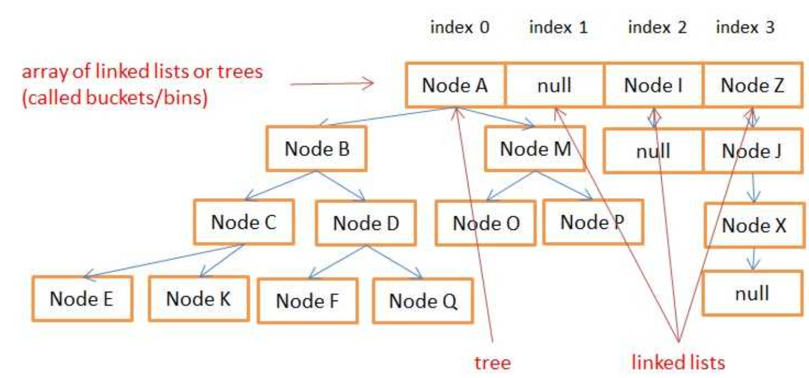

#### 知识点

HashMap底层使用数组（桶）+链表/红黑树实现



负载因子默认为0.75，默认大小为16，当Map中的容量超过12时，需要扩容

#### 类成员对象

```java
@java.io.Serial
private static final long serialVersionUID = 362498820763181265L;

static final int DEFAULT_INITIAL_CAPACITY = 1 << 4; // 默认容量（数组长度） aka 16

static final int MAXIMUM_CAPACITY = 1 << 30; //最大容量

static final float DEFAULT_LOAD_FACTOR = 0.75f; // 默认负载因子

static final int TREEIFY_THRESHOLD = 8; //由链表转为树的阈值

static final int UNTREEIFY_THRESHOLD = 6; // 由树转为链表的阈值

static final int MIN_TREEIFY_CAPACITY = 64; //红黑树默认容量

transient Node<K,V>[] table; //数组/桶的大小(容量总为2的次方)

transient Set<Map.Entry<K,V>> entrySet; //实际存放键值对的

transient int size; //具体元素（键值对）的个数

transient int modCount; //总修改次数

int threshold;

final float loadFactor;
```

**threshold = capacity * loadFactor** ，当size>threhold，就需要扩容，进行rehash、重新分布数据等操作

默认容量为16，负载因子为0.75f，所以当数量到了12之后就需要扩容

#### 构造方法

```java
	
		//默认构造方法
		public HashMap() {
        this.loadFactor = DEFAULT_LOAD_FACTOR; // all other fields defaulted
    }

		// 指定初始容量
		public HashMap(int initialCapacity) {
        this(initialCapacity, DEFAULT_LOAD_FACTOR);
    }
	
		public HashMap(int initialCapacity, float loadFactor) {
        if (initialCapacity < 0)
            throw new IllegalArgumentException("Illegal initial capacity: " +
                                               initialCapacity);
        if (initialCapacity > MAXIMUM_CAPACITY)
            initialCapacity = MAXIMUM_CAPACITY;
        if (loadFactor <= 0 || Float.isNaN(loadFactor))
            throw new IllegalArgumentException("Illegal load factor: " +
                                               loadFactor);
        this.loadFactor = loadFactor;
        this.threshold = tableSizeFor(initialCapacity);
    }
  
    public HashMap(Map<? extends K, ? extends V> m) {
        this.loadFactor = DEFAULT_LOAD_FACTOR;
        putMapEntries(m, false);
    }
```

#### hash方法

```java
		static final int hash(Object key) {
        int h;
        return (key == null) ? 0 : (h = key.hashCode()) ^ (h >>> 16);
    }
```

当链表长度大于阈值（默认为 8）时，会首先调用 `treeifyBin()`方法。这个方法会根据 HashMap 数组来决定是否转换为红黑树。只有当数组长度大于或者等于 64 的情况下，才会执行转换红黑树操作，以减少搜索时间。否则，就是只是执行 `resize()` 方法对数组扩容。
