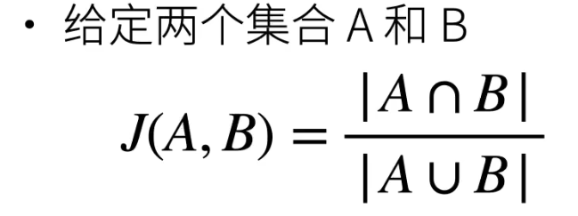

### 数据初始化

```python
def init_weights(m):
    if type(m) in [nn.Linear, nn.Conv2d]:
        nn.init.xavier_uniform_(m.weight)

net.apply(init_weights)
```


### 32 硬件 TPU和其他

**DSP 数字信号处理**

为数字信号处理算法设计，如点积，卷积，FFT。低功耗高性能

核少，频率低，但用了VLIW 超长指令

**FPGA 可编程阵列**

逻辑单元可以编程

**ASIC**

核心是systolic array

### 33 单机多卡并行

当一个模型能用单卡计算时，通常使用数据并行拓展到多卡上

模型并行则用在超大模型上   


### 36 数据增广

增加一个已有数据集，使得有更多的多样性 

​	在语言里面加入各种不同的背景噪音

​	改变图片的颜色和形状

用于训练的时候  

```python
torchvision.transforms.RandomHorizontalFlip() # 随机翻转
torchvision.transforms.RandomResizedCrop() # 随机剪裁
torchvision.transforms.ColorJitter() # 色调相关 
```


### 37 微调 fine tune

把在源数据集中训练模型的特征提取部分用在新数据集上微调训练，分类层再使用随机初始化

学习率较小，epoch较小，正则化更强

源数据集远复杂于目标数据集，效果才比较好

```python
finetune_net = torchvision.models.resnet18(pretrained=True)
finetune_net.fc=nn.Linear(finetune_net.fc.in_features,2)
nn.init.xavier_uniform_(finetune_net.fc.weight)
```


### 41 物体检测和数据集

cocodataset


### 42 锚框

交并比 IOU

用来计算两个框之间的相似度



使用非极大值抑制（NMS）输出

- 用于合并相似的预测
- 先选出非背景类的最大预测值的锚框，然后去掉其他和该锚框IoU值大于某阈值的预测


### 44 R-CNN SSD YOLO

RCNN基于锚框和CNN

RCNN精度较高，但计算成本和内存成本也比较高

##### Fast-RCNN

使用CNN对图片抽取特征

使用RoI池化层对每个锚框生成固定长度特征

  

##### Faster-RCNN


##### Mask-RCNN  


##### 单发多框检测 single shot detection SSD 


##### YOLO

将图片分为许多锚框，每个锚框预测多个边缘框


### 46 语义分割

语义分割将每个像素分类到对应的类别

实例分割

语义分割数据集：PascalVOC2012


### 47 转置卷积

卷积不会增大输入的高宽，要么不变或减半

转置卷积可以用来增大输入高宽


### 48 全连接卷积神经网络（FCN）

把CNN网络最后的全连接层去掉，再加上卷积层和转置卷积


### 49 样式迁移

训练出一个图片，使得在某个卷积输出层的结果与原图对应层的结果相似，又在别的层的结果与风格图片相似

匹配风格的层数均匀分布在各个层，匹配原内容的层数较大


## 序列模型


### 51 序列模型

自回归模型

给定以前的模型，

•时序模型中，当前数据跟之前观察到的数据相关 

•自回归模型使用自身过去数据来预测未来 

• 马尔科夫模型假设当前只跟最近少数数据相关， 从而简化模型

•潜变量模型使用潜变量来概括历史信息


### 52 文本预处理


### 53 语言模型


### 54 RNN
