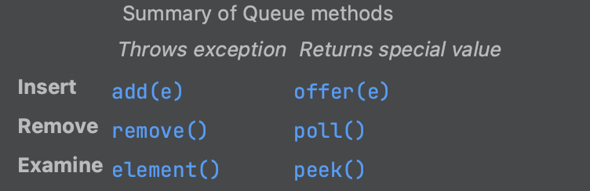
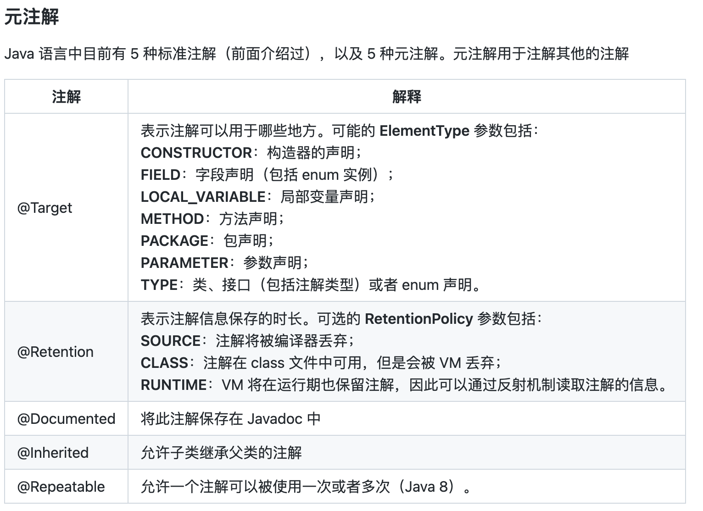

## 第一章 对象的概念

发送消息给对象时，如果程序不知道接收的具体类型是什么，但最终执行是正确的，这就是对象的“多态性”（Polymorphism）。面向对象的程序设计语言是通过“动态绑定”的方式来实现对象的多态性的。编译器和运行时系统会负责对所有细节的控制；


## 第三章 对象

基本类型有自己对应的包装类型，如果你希望在堆内存里表示基本类型的数据，就需要用到它们的包装类。

```java
char c = 'x';
Character ch = new Character(c);
```


当我们使用 `new` 关键字来创建 Java 对象时，它的生命周期将会超出作用域。但是当该对象不可达之后，垃圾回收器将发挥作用

基本类型默认值只对类内变量初始化时有用，定义常规的局部变量时并不会初始化


## 第四章 运算符

基本类型的赋值是复制操作，对象赋值是其内存的引用


```java
public static void main(String[] args) {
        Integer n1 = 47;
        Integer n2 = 47;
        System.out.println(n1 == n2);
        System.out.println(n1 != n2);
    }
```

此时的结果为：

```java
true
false
```

原因是IntegerCache 的缓存，默认缓存范围是 [-128, 127]，所以 [-128, 127] 之间的值用 `==` 和 `!=` 比较也能能到正确的结果，但是不推荐用关系运算符比较

如果改成128，结果则为 `false ture`


```java
Integer.MAX_VALUE
```


## 第六章 初始化和清理

类中的函数可以 `return this` 来返回当前的对象引用

引用计数常用来说明垃圾回收的工作方式，但似乎从未被应用于任何一种 Java 虚拟机实现中。

Java 虚拟机采用了一种*自适应*的垃圾回收技术。至于如何处理找到的存活对象，取决于不同的 Java 虚拟机实现。其中有一种做法叫做停止-复制（stop-and-copy）。顾名思义，这需要先暂停程序的运行（不属于后台回收模式），然后将所有存活的对象从当前堆复制到另一个堆，没有复制的就是需要被垃圾回收的。另外，当对象被复制到新堆时，它们是一个挨着一个紧凑排列，然后就可以按照前面描述的那样简单、直接地分配新空间了。

一些 Java 虚拟机会进行检查：要是没有新垃圾产生，就会转换到另一种模式（即"自适应"）。这种模式称为标记-清扫（mark-and-sweep）

"标记-清扫"所依据的思路仍然是从栈和静态存储区出发，遍历所有的引用，找出所有存活的对象。但是，每当找到一个存活对象，就给对象设一个标记，并不回收它。只有当标记过程完成后，清理动作才开始。在清理过程中，没有标记的对象将被释放，不会发生任何复制动作。"标记-清扫"后剩下的堆空间是不连续的，垃圾回收器要是希望得到连续空间的话，就需要重新整理剩下的对象。


##### 可变参数列表

```java
static void printArray(Object... args){
  for (Object obj: args) {
  }
}
```

可变参数列表不依赖于自动装箱，而使用的是基本类型，但也可以自动装箱


## 第七章 封装

相同包内的其他类可以访问 **protected** 元素

将接口与实现分离。如果在一组程序中使用接口，而客户端程序员只能向 **public** 接口发送消息的话，那么就可以自由地修改任何不是 **public** 的事物（例如包访问权限，protected，或 private 修饰的事物），却不会破坏客户端代码。

每个编译单元（即每个文件）中只能有一个 **public** 类。


## 第八章 复用

可以为每个类创建一个 `main()` ; 这允许对每个类进行简单的测试。当你完成测试时，不需要删除 `main()`; 你可以将其留在以后的测试中。

重载时，在派生类中重新定义该方法名不会隐藏任何基类版本。不管方法是在这个级别定义的，还是在基类中定义的，重载都会起作用:

对于基本类型，**final** 使数值恒定不变，而对于对象引用，**final** 使引用恒定不变。


## 第九章 多态

*多态提供了另一个维度的接口与实现分离，以解耦做什么和怎么做。多态不仅能改善代码的组织，提高代码的可读性，而且能创建有扩展性的程序——无论在最初创建项目时还是在添加新特性时都可以“生长”的程序。*

销毁的顺序应该与初始化的顺序相反，以防一个对象依赖另一个对象。

编写构造器有一条良好规范：做尽量少的事让对象进入良好状态。如果有可能的话，尽量不要调用类中的任何方法。


## 第十章 接口

包含抽象方法的类叫做*抽象类*。如果一个类包含一个或多个抽象方法，那么类本身也必须限定为抽象的，否则，编译器会报错。

接口与抽象类最明显的区别可能就是使用上的惯用方式。接口的典型使用是代表一个类的类型或一个形容词，如 Runnable 或 Serializable，而抽象类通常是类层次结构的一部分或一件事物的类型，如 String 或 ActionHero。

可以向上转型为每个接口

通常来说，**extends** 只能用于单一类，但是在构建接口时可以引用多个基类接口。


## 第十一章 内部类

未读


## 第十二章 集合

### Collection

所有的Collection都有add方法

**java.util.AbstractCollection** 类提供了 **Collection** 的默认实现，你可以创建 **AbstractCollection** 的子类型来避免不必要的代码重复。

#### List

##### **ArrayList**

擅长随机访问元素，但在 **List** 中间插入和删除元素时速度较慢

##### **LinkedList**

它通过代价较低的在 **List** 中间进行的插入和删除操作，提供了优化的顺序访问。 **LinkedList** 对于随机访问来说相对较慢，但它具有比 **ArrayList** 更大的特征集。

**LinkedList 还添加了一些方法，使其可以被用作栈、队列或双端队列（deque）** 。在这些方法中，有些彼此之间可能只是名称有些差异，或者只存在些许差异，以使得这些名字在特定用法的上下文环境中更加适用（特别是在 **Queue** 中）。例如：

- `getFirst()` 和 `element()` 是相同的，它们都返回列表的头部（第一个元素）而并不删除它，如果 **List** 为空，则抛出 **NoSuchElementException** 异常。 `peek()` 方法与这两个方法只是稍有差异，它在列表为空时返回 **null** 。
- `removeFirst()` 和 `remove()` 也是相同的，它们删除并返回列表的头部元素，并在列表为空时抛出 **NoSuchElementException** 异常。 `poll()` 稍有差异，它在列表为空时返回 **null** 。
- `addFirst()` 在列表的开头插入一个元素。
- `offer()` 与 `add()` 和 `addLast()` 相同。 它们都在列表的尾部（末尾）添加一个元素。
- `removeLast()` 删除并返回列表的最后一个元素。


### Set

**TreeSet** 将元素存储在红-黑树数据结构中，而 **HashSet** 使用散列函数。 **LinkedHashSet** 也使用散列来提高查询速度，但是似乎使用了链表来维护元素的插入顺序。

##### **HashSet**

##### **TreeSet**

##### **LinkedHashSet**


### Map

##### **HashMap**

##### **TreeMap**

##### **LinkedHashMap**


### Queue

**LinkedList** 实现了 **Queue** 接口，并且提供了一些方法以支持队列行为，因此 **LinkedList** 可以用作 **Queue** 的一种实现，将 **LinkedList** 向上转换为 **Queue** 。

```java
Queue<Integer> queue = new LinkedList<>();
```

`offer()` 是 **Queue** 的特有方法之一，它在允许的情况下，在队列的尾部插入一个元素。`peek()` 和 `element()` 都返回队头元素而不删除它，但如果队列为空，则 `peek()` 返回 **null** ， 而 `element()` 抛出 **NoSuchElementException** 。 `poll()` 和 `remove()` 都删除并返回队头元素，但如果队列为空，则 `poll()` 返回 **null** ，而 `remove()` 抛出 **NoSuchElementException** 。



#### 优先级队列PriorityQueue

当在 **PriorityQueue** 上调用 `offer()` 方法来插入一个对象时，该对象会在队列中被排序。[5](https://github.com/LingCoder/OnJava8/blob/1ef7ec48e492862300e667e24c245e9b3a5ccd98/docs/book/12-Collections.md#user-content-fn-5-c4168f550293429295b486dc85751ec9)默认的排序使用队列中对象的*自然顺序*（natural order），但是可以通过提供自己的 **Comparator** 来修改这个顺序。 **PriorityQueue** 确保在调用 `peek()` ， `poll()` 或 `remove()` 方法时，获得的元素将是队列中优先级最高的元素。

```java
PriorityQueue<Integer> priorityQueue = new PriorityQueue<>();
```

#### 迭代器

**ListIterator** 是一个更强大的 **Iterator** 子类型，它只能由各种 **List** 类生成。 **Iterator** 只能向前移动，而 **ListIterator** 可以双向移动。


## *第十三章 函数式编程

Lambda 表达式产生函数，而不是类。 


函数引用 跳过


## *第十四章 流式编程


## *第十五章 异常

finally 子句总能运行，在try中return时，finally中的语句仍能运行


## 第十六章 代码校验

主要讲 Junit 断言 Guava库等


## 第十七章 文件

文件路径操作等


## 第十八章 字符串

`String` 对象是不可变的。

`StringBuffer`是线程安全的，因此开销也会大些。使用 `StringBuilder` 进行字符串操作更快一点。


## *第十九章 类型信息

所有的类都是第一次使用时动态加载到 JVM 中的，当程序创建第一个对类的静态成员的引用时，就会加载这个类。

Java 程序在它开始运行之前并没有被完全加载，很多部分是在需要时才会加载。这一点与许多传统编程语言不同，动态加载使得 Java 具有一些静态加载语言（如 C++）很难或者根本不可能实现的特性。


如果你不知道对象的确切类型，RTTI 会告诉你。但是，有一个限制：必须在编译时知道类型，才能使用 RTTI 检测它，并对信息做一些有用的事情。换句话说，**编译器必须知道你使用的所有类**。

起初，这看起来并没有那么大的限制，但是假设你引用了一个**不在程序空间中的对象**。实际上，该对象的类在编译时甚至对程序都不可用。也许你从磁盘文件或网络连接中获得了大量的字节，并被告知这些字节代表一个类。由于这个类在编译器为你的程序生成代码后很长时间才会出现，你如何使用这样的类？


重要的是要意识到反射没有什么魔力。当你使用反射与未知类型的对象交互时，JVM 将查看该对象，并看到它属于特定的类（就像普通的 RTTI）。在对其执行任何操作之前，必须加载 `Class` 对象。因此，该特定类型的 `.class` 文件必须在本地计算机上或通过网络对 JVM 仍然可用。因此，RTTI 和反射的真正区别在于，使用 RTTI 时，编译器在编译时会打开并检查 `.class` 文件。换句话说，你可以用“正常”的方式调用一个对象的所有方法。通过反射，`.class` 文件在编译时不可用；它由运行时环境打开并检查。


## 第二十章 泛型

编程语言中泛型出现的初衷是通过解耦类或方法与所使用的类型之间的约束，使得类或方法具备最宽泛的表达力。


## 第二十三章 注解

- **@Override**：表示当前的方法定义将覆盖基类的方法。如果你不小心拼写错误，或者方法签名被错误拼写的时候，编译器就会发出错误提示。
- **@Deprecated**：如果使用该注解的元素被调用，编译器就会发出警告信息。
- **@SuppressWarnings**：关闭不当的编译器警告信息。
- **@SafeVarargs**：在 Java 7 中加入用于禁止对具有泛型varargs参数的方法或构造函数的调用方发出警告。
- **@FunctionalInterface**：Java 8 中加入用于表示类型声明为函数式接口。




```java
@Target(ElementType.METHOD)
@Retention(RetentionPolicy.RUNTIME)
public @interface Test {
    int id();
    String description() default "no description";
}
```

除了 @ 符号之外， `@Test` 的定义看起来更像一个空接口。注解的定义也需要一些元注解（meta-annotation），比如 `@Target` 和 `@Retention`。`@Target` 定义你的注解可以应用在哪里（例如是方法还是字段）。`@Retention` 定义了注解在哪里可用，在源代码中（SOURCE），class文件（CLASS）中或者是在运行时（RUNTIME）。

**如果没有用于读取注解的工具，那么注解不会比注释更有用。**使用注解中一个很重要的部分就是，创建与使用注解处理器。Java 拓展了反射机制的 API 用于帮助你创造这类工具。同时他还提供了 javac 编译器钩子在编译时使用注解。


## 第二十四章 并行

> 并发性是一系列专注于减少等待的性能技术

- “减少等待”部分很重要而且微妙。无论（例如）你的程序运行在多少个处理器上，你只能在等待发生时产生效益。如果你发起 I/O 请求并立即获得结果，没有延迟，因此无需改进。如**果你在多个处理器上运行多个任务，并且每个处理器都以满容量运行，并且没有任务需要等待其他任务，那么尝试提高吞吐量是没有意义的。**并发的唯一机会是程序的某些部分被迫等待。等待会以多种形式出现 - 这解释了为什么存在多种不同的并发方法。

**并行Stream**

**CompletableFutures**
