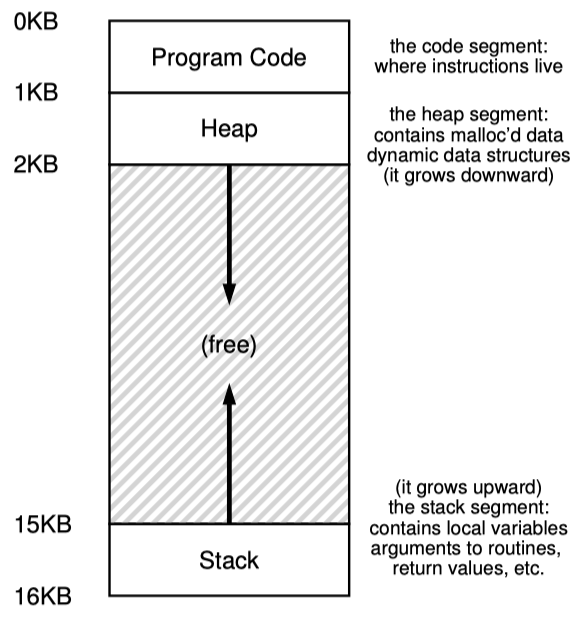
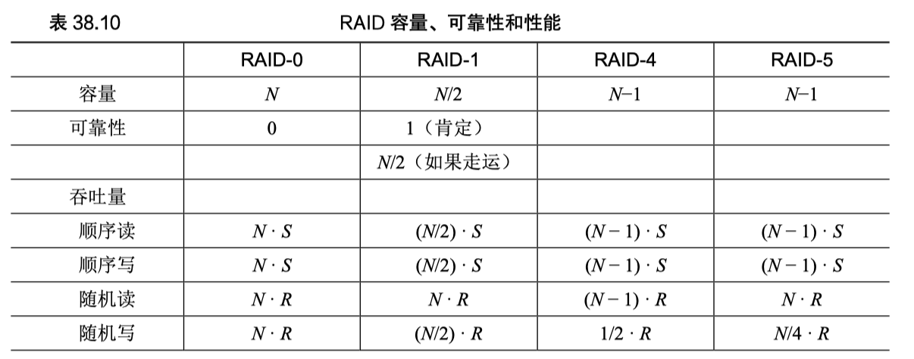

# Part 1 虚拟化

### 第8章 调度：多级反馈队列

### 第9章 调度：比例份额（彩票）

彩票调度通过使用随机值来做到了按比例分配，但在各个工作执行时间较短时，公平性较不好，只有当工作执行非常多的时间片时，彩票调度才能得到预期的公平性。

步长调度是用一个大数除以各个进程的彩票数，得到各个进程的步长，每一次运行时增加一次步长到对应进程的行程值，每次调度行程值最少的进程
彩票调度不需要全局状态（但加入一个新进程时不用考虑如何处理该进程），步长调度可以精确控制
但无论如何，都有无法解决的问题：即如何确定谋和进程应该拥有多少票数，以及无法很好地适应I/O

### 第10章 多处理器调度

缓存亲和度：一个进程在某个CPU上运行时，会在该CPU缓存中维护许多状态。但切换CPU运行时，需要重新加载数据。

单队列多处理器调度：将所有需要调度的工作放入一个单独的队列中。优势是实现简单，但缺乏可扩展性（代码中要加锁，会有性能开销），同时也不能保证较好的缓存亲和度。

多队列多处理器调度：存在多个进程调度队列，每个队列可以使用不同的调度规则。每个队列对应一个CPU，则避免了单队列方式中数据共享和同步带来的问题。可扩展性好，因为队列数可以根据CPU数调整，缓存亲和度也好。使用进程迁移来尝试解决不同队列负债不均的问题

Linux中的调度方法：O(1)调度，CFS，BFS

### 第13章 抽象：地址空间

栈从高地址往低地址，保存函数调用信息，局部变量，传参和函数返回值
堆用于管理动态分配、用户管理的内存，如C语言的malloc()和C++\Java的new

### 第15章 机制：地址转换

进程中使用的内存引用都是虚拟地址，操作系统联合硬件把虚拟地址转换为物理地址

### 第16章 分段

分段好处：避免地址空间逻辑段之间存在的大量内存浪费，也可以实现代码共享
不足：外部碎片，分段还是不足以支持更一般化的稀疏地址空间

# Part 2 并发

### 第28章 锁

评价锁的标准：

1. 互斥是否有效
2. 是否公平，即每一个竞争线程有公平机会抢到锁（或是否会有竞争进程饿死）
3. 性能（没竞争情况、一个CPU上竞争情况、多个CPU上竞争情况）

##### 控制中断（关中断

##### 原子交换(test and set)

##### 比较并交换(compare and exchange)

##### 条件式存储(store conditional)

##### 获取并增加(fetch and add)

# Part 3 持久化

### 第38章 RAID

评价指标：容量，可靠性，性能

#### RAID 0 ：条带化

以轮转方式将磁盘阵列的块分布在磁盘上

目的是为了在对数组的连续块进行请求时，从阵列中获取最大的并行性

容量非常高，可靠性非常差，性能非常好

#### RAID 1 ：镜像

使用镜像对，再在其上使用条带化

对镜像的实际的写入可以并行

容量只有一半，可靠性良好

读取性能与RAID0一致，但写入时间可能会略高一点点

顺序写入时的最大带宽是峰值带宽的一半；顺序读取的性能也为峰值性能的一半，因为磁盘在跳过的块时要旋转，不会提供有用的带宽

随机写入时的最大带宽是峰值带宽的一半；随机读取时的性能即为峰值性能

#### RAID 4 ：奇偶校验

试图使用较少的容量客服镜像的空间损失，不过代价是降低性能。

预留磁盘来存储条块的冗余信息（奇偶校验），在发生磁盘故障时也可以利用奇偶校验信息从故障中恢复

容量：使用一个磁盘用于奇偶校验信息，容量为（N-1）

可靠性：容许一个磁盘故障

性能：顺序读取和写入，随机读取都为较高；随机写入时会有问题

由于存在奇偶校验磁盘，对系统的写操作将被序列化。奇偶校验磁盘需要对每个逻辑I/O执行两次I/O，性能大概只有一半。

随机小写入下的RAID 4 性能很差，添加磁盘也不会改善性能

#### RAID 5 ：旋转奇偶校验

为了解决RAID 4 的小写入问题，把奇偶校验块跨驱动器旋转

和RAID 4 有效容量和容错能力相同，顺序读写性能相同

RAID 5 随机读取性能稍好一点，随机写入性能显著提高

#### 比较

