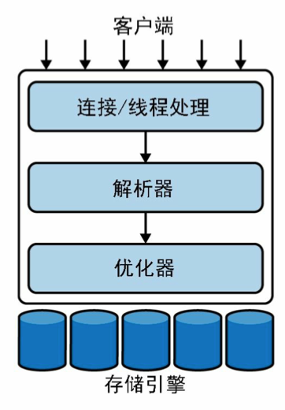

注：私人笔记偏向于整理过去不太了解的点或带来新观点的内容，对较为熟悉的通用概念不做冗余整理

## 第1章 MySQL架构

服务器级别层：客户端的连接处理、身份验证、确保安全等

查询执行层：查询解析、分析、优化以及所有内置函数；存储过程、触发器、视图等

存储引擎：存储引擎负责MySQL中的数据存储和提取。与Linux下的各种文件系统类似，每种存储引擎间各有优劣。存储引擎不会去解析SQL

每个客户端连接都会在服务器进程中拥有一个线程。服务器维护了一个缓冲区，用于存放已就绪的线程，因此不需要为每个新的连接创建或者销毁线程（线程池）

表锁的开销最小，但并发性能当然不好。写锁队列和读锁队列分开，且写锁队列优先级高于读队列。

行锁的加锁开销很大，要跟踪谁拥有这些行级锁、已经锁定了多长时间、行级锁的类型、何时该清理不再需要的行级锁等。

**行级锁是在存储引擎而不是服务器中实现**（比如MyISAM不支持行级锁，InnoDB支持）

**事务是由下层的存储引擎实现的**

有一些命令，当在活动的事务中发出时，会导致MySQL在事务的所有语句执行完毕前提交当前事务。这些通常是进行重大更改的DDL命令，如ALTER TABLE，但LOCK TABLES和其他一些语句也具有同样的效果。

假如在事务中混合使用事务表和非事务表（MyISAM和InnoDB），当需要回滚时，无法撤销对非事务表的修改。所以避免在应用中混合使用存储引擎

MySQL被设计用于在任何给定时间只在一个节点上接受写操作

InnoDB默认为REPEATABLE READ隔离级别，并且通过间隙锁（next-key locking）策略来防止在这个隔离级别上的幻读：InnoDB不只锁定在查询中涉及的行，还会对索引结构中的间隙进行 锁定，以防止幻行被插入。

**因为二级索引（secondary index，非主键索引）需要包含主键列， 如果主键较大，则其他索引也会很大。如果表中的索引较多，主键应当尽量小。**

## 第4章 操作系统和硬件优化

## 第6章 schema设计与管理

尽量避免存储NULL，如果查询中包含可为NULL的列，对MySQL来说更难优化，因为可为NULL的列使得索引、索引统计和值比较都更复杂。

MySQL可以为整数类型指定宽度，例如，`INT(11)`，这对大多数应用毫无意义：它不会 限制值的合法范围，只是规定了MySQL的一些交互工具（例如，MySQL命令行客户端） 用来显示字符的个数。对于存储和计算来说，`INT(1)`和 `INT(20)`是相同的。

但在一些大容量的场景，可以考虑使用 `BIGINT`代替 `DECIMAL`，将需要存储的货币单位根据小数的位数乘以相应的倍数即可。假设要存储财务数据并精确到万分之一分，则可以把所有金额乘以一百万，然后将结果存储在 `BIGINT` 里，这样可以同时避免浮点存储计算不精确和 `DECIMAL`精确计算代价高的问题。

## 第7章 创建高性能的索引

索引能够轻易将查询性能提高几个数量级，“最优”的索引有时比一个“好的”索引性能要好两个数量级。

在MySQL中，索引是在存储引 擎层而不是服务器层实现的。(所以InnoDB是聚簇索引，MyISAM是非聚簇索引)

> 自适应哈希索引。InnoDB存储引擎有一个被称为**自适应哈希索引**的特性。当InnoDB发现某些索引值被非常频繁地被访问时，它会在原有的B-tree索引之上，在内存中再构建一个哈希索引。这就让B-tree索引也具备了一些哈希索引的优势，例如，可以实现非常快速的 哈希查找。这个过程是完全自动化的，用户无法进行控制或者配置。不过，可以通过参数彻底关闭自适应哈希索引这个特性。

B-tree索引通常可以支持“只访问索引的查询”，即查询只需要访问索引，而无须访问数据行。称为覆盖索引

**索引限制：**

> 如果不是按照索引的最左列开始查找，则无法使用索引。
>
> 不能跳过索引中的列：索引了A，B，C三列；索引用于不能指定找特定A+C的情况
>
> 如果查询中有某列的范围查询，则其右边所有列都无法使用索引优化查找。

索引可以让服务器快速地定位到表的指定位置；最常见的B-tree索引，按照顺序存储数据，所以MySQL可以用来做**ORDER BY和GROUP BY操作**。最后，因为索引中存储了实际的列值，所以某些查询只使用索引就能够完成全部查询。

前缀索引是一种能使索引更小、更快的有效办法，但它也有缺点：MySQL无法使用前缀 索引做ORDER BY和GROUP BY操作，也无法使用前缀索引做覆盖扫描。

在多列上独立地创建多个单列索引，在大部分情况下并不能提高MySQL的查询性能。

InnoDB的聚簇索引实际上在同一个结构中保存了B-tree索引和数据行。当表有聚簇索引时，它的数据行实际上存放在索引的叶子页（leaf page）中。

因为无法同时把数据行存放在两个不同的地方，所以**一个表只能有一个聚簇索引**

如果你没有定义主键，InnoDB会选择一个唯一的非空索引代替。如果没有这样的索引， InnoDB会隐式定义一个主键来作为聚簇索引。

通过二级索引查找行，存储引擎需要找到二级索引的叶子节点，以获得对应的主 键值，然后根据这个值去聚簇索引中查找对应的行。

聚簇索引的每一个叶子节点都包含了**主键值、事务ID、用于事务和MVCC的回滚指针**，以及所有的剩余列

InnoDB的二级索引的叶子节点中存储的是主键值，并以此作为指向行的“指针”。这样的策略减少了当出现行移动或者数据页分裂时二级索引的维护工作。使用主键值作为指针**会让二级索引占用更多的空间**，换来的好处是，**InnoDB在移动行时无须更新二级索引中的这个“指针”**。

最好避免随机的（不连续且值的分布范围非常大）聚簇索引，特别是对于I/O密集型的应 用。例如，从性能的角度考虑，**使用UUID作为聚簇索引会很糟糕**

使用InnoDB时应该**尽可能地按主键顺序插入数据**，并且尽可能地按照单调增加的聚簇键的值顺序插入新记录

## 第8章 查询性能优化

一般地，MySQL能够使用如下三种方式应用WHERE条件，从好到坏依次为：

* 在索引中使用WHERE条件来过滤不匹配的记录。这是在存储引擎层完成的。
* 使用索引覆盖扫描（在Extra列中出现了Using index）来返回记录，直接从索引中过滤不需要的记录并返回命中的结果。这是在MySQL服务器层完成的，但无须再回 表查询记录。
* 从数据表中返回数据，然后过滤不满足条件的记录（在Extra列中出现Using where）。这在MySQL服务器层完成，MySQL需要先从数据表中读出记录然后过

**重构查询：**

* 将一个大的DELETE语句切分成多个较小的查询可以尽可能小地影响 MySQL的性能，同时还可以降低MySQL复制的延迟。
* 将查询分解后，执行单个查询可以减少锁的竞争。
* 在应用层做联接，可以更容易对数据库进行拆分，更容易做到高性能和可扩展。

MySQL的客户端和服务器之间的通信协议是“半双工”的，在任何时刻，要么是由服务器向客户端发送数据，要么是由客户端向服务器发送数据，这两个动作不能同时发生。

一旦一端开始发送消息，另一端要接收完整个消息才能响应它。

将一个SQL查询转换成一个执行计划，MySQL再依照这个执 行计划和存储引擎进行交互。这包括多个子阶段：解析SQL、预处理、优化SQL执行计划。

* 语法解析器和预处理：MySQL通过关键字将SQL语句进行解析，并生成一棵对应的“解析树”。MySQL解析器将使用MySQL语法规则验证和解析查询。
* 查询优化器：一条查询可以有很多种执行方式，最后都返回相同的结果。优化器的作用就是找到这其中最好的执行计 划。MySQL使用基于成本的优化器，它将尝试预测一个查询使用某种执行计划时的成本，并选择其中成本最小的一个。

COUNT()的另一个作用是统计结果集的行数。当MySQL确认括号内的表达式值不可能为空时，实际上就是在统计行数。最简单的就是当我们使用COUNT（*）的时候，这种情况 下通配符*并不会像我们猜想的那样扩展成所有的列，实际上，它会忽略所有的列而直接统计所有的行数。

我们发现最常见的错误之一是，当需要统计行数时，在COUNT()函数的括号内指定了列名。如果想要知道结果中的行数，应该始终使用COUNT（*）
