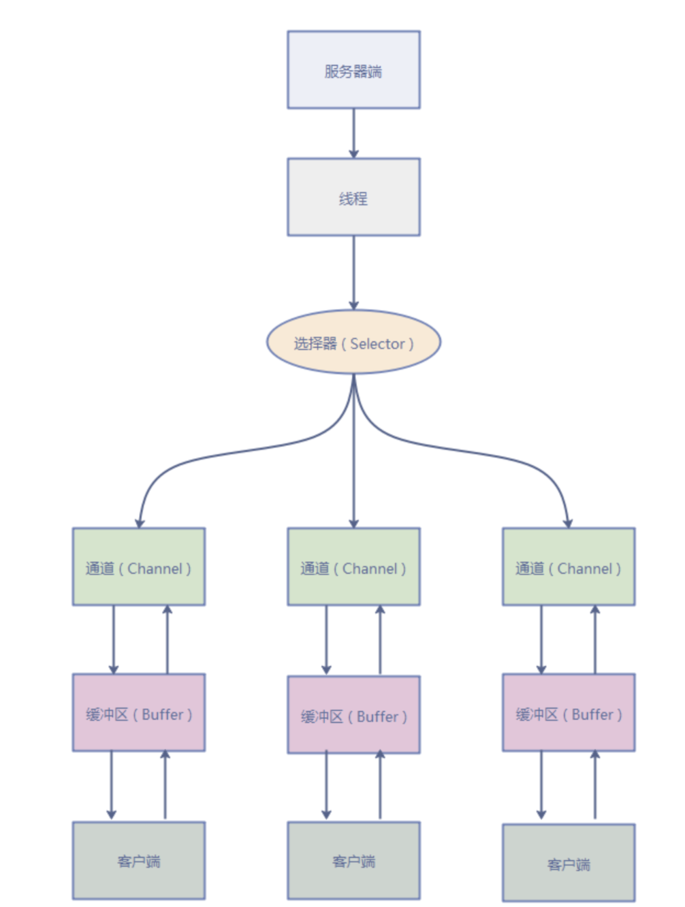

### BIO Blocking I/O

应用程序发起read请求后，会一直阻塞，直到内核把数据拷贝到用户空间

一个客户端连接请求，使用服务器的一个线程

* 当并发数很大时，会创建大量的线程，占用服务器大量资源
* 连接创建后如果线程暂时没有数据读，线程会阻塞在read操作，造成线程资源浪费

### NIO Non-blocking/New I/O

JDK 1.4引入，对应java.nio包，提供**Channel、Selector、Buffer**等抽象

Buffer存储数据，Channel运输数据，Selector检查多个Channel的状态变更情况

Buffer切换为读模式时需要filp()

传统IO以字节为单位处理，NIO以块（缓冲区）来处理，NIO可以实现非阻塞

应用程序发起read调用，等待数据从内核空间拷贝到用户空间，如果有数据就直接返回，没数据就可以去执行别的任务，通过轮询的方式查看数据是否已经准备好

#### **I/O多路复用**

使用操作系统提供的多路复用功能（select、poll、epoll等），当某个连接上的数据准备好时，操作系统会通知应用程序。这样应用程序可以在一个线程中处理多个并发连接，而不需要为每个连接创建一个线程

线程发起select调用，询问内核数据是否准备就绪，内核把数据准备好，用户线程再发起read调用

* fd：file descriptor 文件描述符，是Unix系统中用于表示打开的文件、套接字和其他I/O对象的整数标识符。
* select调用：Unix内核最早提供的I/O多路复用系统调用，支持的最大连接数为1024或2048，fd_set位为0则还没数据到缓冲区，位为1则数据已到缓冲区。性能受限，每次调用都需要传递这个掩码，且在内核和用户空间之间复制。
* poll调用：select的改进，使用文件描述符数组而不是位掩码表示文件描述符集。但仍然需要遍历整个文件描述符数组，性能仍然受限。
* epoll调用：linux2.6，属于select的增强，不是遍历所有的文件描述符fd，而是epoll把就绪的文件描述符维护了一块空间，每次从就绪列表里拿。当某文件描述符上的I/O时间发生时，内核会将该事件添加到事件表中，应用程序使用epoll_wait()获取已经准备好的时间，而无需遍历

一个选择器管理多个客户端连接

#### 代码流程

**Server**

1. 获取通道，切换非阻塞模式后绑定监听端口
2. 获取选择器，把通道绑定到选择器上
3. 轮询获取选择器上已经就绪的事件（监听通道）
4. 获取所有已注册的键，获取已就绪的时间
5. 根据就绪事件是客户端连接请求还是读时间，采取不同的行动

### AIO Asynchronous I/O

Java 7 后引入的改进版 NIO2

基于事件和回调，即应用操作之后会直接返回而不是阻塞，当后台处理完成后，操作系统会通知相应线程进行后续操作

### **零拷贝**

读请求时一般是调用read系统调用，DMA把磁盘数据拷贝到内核空间，CPU把内核缓冲区数据拷贝到用户缓冲区。

经历2次DMA拷贝+2次CPU拷贝

零拷贝技术一种思想，指的是**不需要CPU**把数据从某处内存复制到另一个区域。**零拷贝不是不拷贝**，而是CPU不再全程负责数据的拷贝工作

* 虚拟内存
  用户空间和内核空间虚拟内存指向同一个物理地址
* sendfile
  情景是用户读取信息后不需要计算和处理就通过网络传输出去，传递文件描述符代替数据拷贝
* mmap
  将内核空间中的缓存直接映射到用户空间缓存
* Direct IO
  用户空间读取的文件直接与磁盘交互
