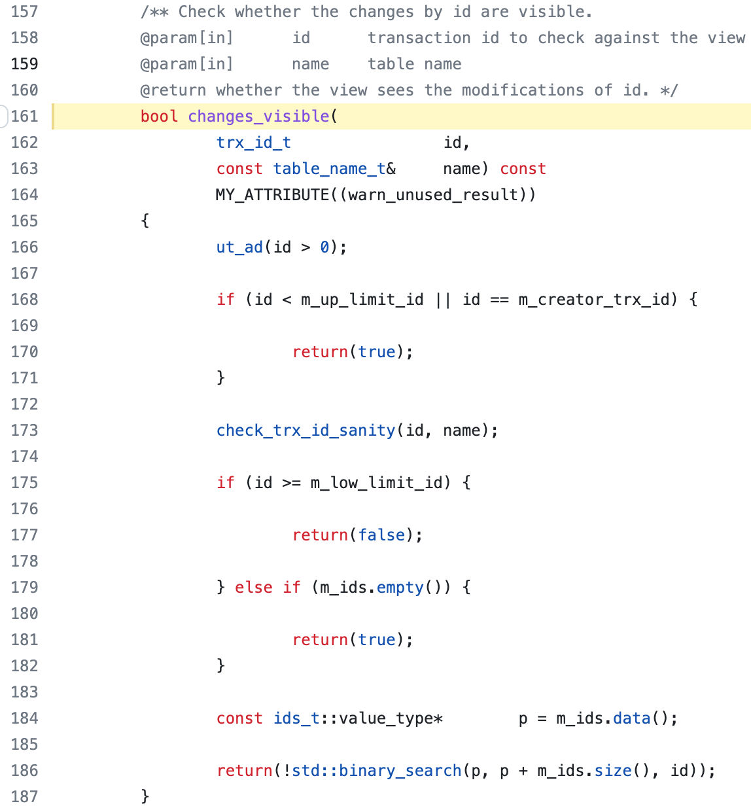

# MySQL

### Mysql基础架构

* 连接器，用于身份认证和权限相关
* 执行查询语句时会先查询缓存（8.0后移除）
* 分析器，如果没有命中缓存则SQL语句会经过分析器
* 优化器，按照Mysql认为最优的方式执行
* 执行器
* 插件式存储引擎（负责数据的存储和读取，支持InnoDB，MyISAM等)

### Mysql默认存储引擎

5.5.5以前使用MyISAM，之后默认使用InnoDB，只有InnoDB支持事务。

存储引擎基于表而不是数据库

### InnoDB和MyISAM区别

* InnoDB支持**行级锁、MVCC**和表级锁，而MyISAM只支持表级锁
* MyISAM不支持**事务**；InnoDB支持事务并实现了SQL标准的四个隔离级别
* MyISAM不支持**外键**，InnoDB支持
* InnoDB支持异常崩溃后的**恢复**，依赖于redo log。MyISAM不支持
* InnoDB数据文件就是索引文件，叶节点data域保存了完整的数据记录（**聚簇索引**）；MyISAM索引文件和数据文件分离
* InnoDB读写能力随CPU核数增加呈线性增长

### 索引

无论是InnoDB还是MyISAM，都使用**B+树**作为索引结构。但实现方式不太一样。

索引的优缺点：

* 优点是使用索引可以大大**加快**数据的检索速度；使用唯一性索引时可以保证数据库表中每一行数据的**唯一**性
* 缺点是创建和维护索引有开销，降低SQL执行效率。索引需要物理文件存储

哈希索引不支持顺序和范围查询

#### B树/B+树

区别：

* B树的所有节点存放key和数据，而B+树只有叶子结点存放key和数据，其他内节点只存放key
* B树中的叶子节点是独立的，B+树中的叶子节点有指向相邻叶子结点的链
* B+树的检索效率稳定，任何查找都是从根节点到叶子节点

MyISAM是非聚簇索引。索引和数据分开存放。B+树叶子结点data域存放的是**对应数据记录的地址**，找记录时如果指定Key存在，取data域的值作为地址读取响应的数据记录

InnoDB是聚簇索引。数据文件本身就是索引文件，表数据文件本身就是按照B+树组织的一个索引结构。**树的叶节点data域保存了完整的数据记录**。这个**索引的key就是数据库的主键。** 其余的索引作为辅助索引，辅助索引的data域存放的是**相应记录主键的值（而不是地址）**

#### 主键索引与二级索引

主键索引唯一，不为null，一张表只能有一个主键

当InnoDB表中，如果没有显式指定主键索引，InnoDB会检查表中是否有唯一索引且不允许为null值的字段，如果存在则设定为主键索引，否则会生成一个6Byte的自增主键

二级索引分为：普通索引，唯一索引，前缀索引，全文索引等

#### 聚簇索引和非聚簇索引

聚簇索引查找速度快，对范围查找和排序查找优化；但**更新代价大**，且依赖有序数据

非聚簇索引更新的代价比聚簇索引小，因为叶子节点不存放数据。但也依赖于有序的数据，而且有可能会**二次查询/回表**

**非聚簇索引一定会回表吗？**

不一定，比如索引的key就是要查的内容，查到对应的值后直接返回，称为覆盖索引

```sql
SELECT name FROM table WHERE name='guang19';
```

#### 覆盖索引和联合索引

如果一个索引包含所有要查询字段的值，则称为覆盖索引

即要查询的字段刚好是索引的字段，name根据索引可以直接查到数据，而不需要回表查询

使用表中的多个字段创建索引，就是联合索引

#### 最左前缀匹配原则

使用联合索引时，MySQL会根据联合索引中的字段顺序从左到右到查询条件中匹配。如果查询条件中存在与联合索引中最左侧字段相匹配的字段，就会过滤一批数据。或者在执行过程中遇到范围查询（>、<）,对于  **`>=`** 、 **`<=`** 、 **`BETWEEN`** 、**`like`** 前缀匹配的范围查询，并不会停止匹配。所以在使用联合索引时，将区分度最高的字段放在左边。

#### 索引下堆

可以在非聚簇索引遍历过程中，对索引中包含的字段先做判断，过滤掉不符合条件的记录，减少回表次数


### MySQL事务

> 事务就是一组SQL 语句，作为一个工作单元以原子方式进行处理      -《高性能MySQL》第四版

事务是逻辑上的一组操作，要么全部执行成功，要么全部执行失败。

* Atomic 原子性：事务是最小的、**不可分割**的执行单元。整个事务中的所有操作要么全部提交成功，要么全部失败回滚。
* Consistency 一致性：数据库总是从一个一致性状态转换到下一个一致性状态
* Isolate 隔离性：并发访问数据库时，一个用户的事务不被及其他事务所干扰。一个事务的修改在最终提交以前，对其他的事务是不可见的
* Durability 持久性：一个事务被提交后，对数据库中数据的改变是持久的。
  A、I、D是手段，C是目的
  原子性基于undo log，持久性基于redo log，隔离性基于锁和MVCC

#### 并发事务带来的问题

* **脏读**
  B事务读取了A事务尚未提交的数据，但是A事务回滚了，B读到的就是脏数据
* **丢失修改**
  A事务读取了数据，B事务也读取了数据，在A修改数据后，B也修改的了数据，A做的修改就丢失了。
* **不可重复读**
  A事务要多次读一个数据，在A事务还没结束时，B事务也访问该数据并修改。A事务在两次读取到的数据不一致，称为不可重复读。
* **幻读**
  与不可重复读类似，都是发生在一个事务执行期间。A事务读取了几行数据，B事务往表里插入数据，A事务再读时就会发现一些原本不存在的记录，和幻觉一样，称为幻读。

#### SQL定义的标准事务隔离级别

* **读取未提交**：最低的隔离级别，允许读取尚未提交的数据变更。可能会导致脏读，不可重复读、幻读
* **读取已提交**：允许读取其他并发事务已提交的修改。可以防止脏读，但是幻读和不可重复读仍有可能发生
* **可重复读**：保证了在同一个事务中多次读取相同行数据的结果是一样的（除非是事务自己修改的）。可以防止脏读和不可重复读，但仍可能发生幻读
* **可串行化**：最高隔离级别，完全服从ACID，所有事务依次执行，事务之间不会产生干扰

| 隔离级别         | 脏读 | 不可重复读 | 幻读 |
| ---------------- | ---- | ---------- | ---- |
| READ-UNCOMMITTED | √   | √         | √   |
| READ-COMMITTED   | ×   | √         | √   |
| REPEATABLE-READ  | ×   | ×         | √   |
| SERIALIZABLE     | ×   | ×         | ×   |

SERIALIZABLE依赖于锁，READ-COMMITTED和REPEATABLE-READ依赖于MVCC

MySQL默认支持的隔离级别是**REPEATABLE-READ可重复读，而且添加了措施（MVCC）防止幻读**

* 快照读：由MVCC来确保不会出现幻读
* 当前读：由Next-Key Lock来加锁保证不会出现幻读

#### MySQL并发事务控制方式

基于悲观控制的**锁**和基于乐观控制的**MVCC**

共享锁S锁在读取记录的时候获取、排它锁X锁在修改记录的时候获取

MVCC是多版本并发控制，对一份数据会存储多个版本，通过事务的可见性保证事务能看到自己应该看到的版本。

实现的依赖手段是隐藏字段、read view和undo log

### MySQL锁

表级锁高并发下效率低，但加锁块。行级锁是针对索引字段加的锁，粒度最小，并发度高，加锁的开销大。

InnoDB的行级锁是针对索引字段加的锁，当我们执行UPDATE，DELETE语句时，如果WHERE条件中字段没有命中唯一索引或者索引失效，会导致扫描全表中所有行记录进行加锁

##### InnoDB有哪几类行级锁

* **记录锁（Record Lock）**：属于单个行记录上的锁
* **间隙锁（Gap Lock）**：锁定一个范围，不包括记录本身
* **临键锁（Next-Key Lock）**：Record Lock + Gap Lock，锁定范围+记录本身。主要是为了解决幻读问题，记录锁只能锁住已经存在的记录，为了避免插入新纪录，需要依赖间隙锁
  在InnoDB默认的可重复度隔离级别下，行锁默认使用Next-Key Lock。但是如果操作的索引是唯一索引或主键，InnoDB会对锁进行优化，降级为Record Lock，仅锁住索引本身

##### 行级锁和表级锁

由于MVCC的存在，对与一般的SELECT语句，InnoDB不加锁，不过可以显式的加锁

```sql
#共享锁
SELECT ... LOCK IN SHARE MODE
#排它锁
SELECT ... FOR UPDATE
```

##### 意向锁

意向锁是用来快速判断是否可以对某个表使用表锁（加表锁前判断表里有没有行锁）。意向锁是表级锁

* **意向共享锁（Intention Shared Lock，IS 锁）** ：事务有意向对表中的某些记录加共享锁（S 锁），加共享锁前必须先取得该表的 IS 锁。
* **意向排他锁（Intention Exclusive Lock，IX 锁）** ：事务有意向对表中的某些记录加排他锁（X 锁），加排他锁之前必须先取得该表的 IX 锁。

意向锁是存储引擎维护的，用户无法自己手动操作意向锁，在为数据行获得S锁/X锁前，需要获得对应的意向锁

**意向锁之间是相互兼容的，表级别的意向锁和共享锁/排它锁有部分互斥**

##### 快照读（一致性非锁定读）和当前读（一致性锁定读）

快照读的情况下，如果读取的记录正在执行UPDATE/DELETE操作，读取操作不会等待记录上X锁的释放，而是会读取行的一个快照

只有在读取已提交和可重复读两个隔离级别下，InnoDB才会使用快照读。适合对**数据一致性要求不是特别高**，且追求极致性能的业务场景

* RC下，对于快照数据，快照读总是读取被锁定行的最新一份快照数据
* RR下，对于快照数据，快照读总是读取本事务开始时候的行数据版本

当前读就是给记录加S/X锁

### InnoDB MVCC的实现

> 可以认为MVCC是行级锁的一个变种，但是它在很多情况下避免了加锁操作，因此开销更低。根据其实现方式，不仅实现了非阻塞的读操作，写操作也只锁定必要的行。  
>
> MVCC的工作原理是使用数据在某个时间点的快照来实现的。

对于**一致性非锁定读（快照读）**，通常做法是加一个版本号或时间戳，在更新数据的同时更新版本号/时间戳。查询时，将当前可见版本号于对应记录版本号对比，如果对应记录版本号小，说明该记录可见。

InnoDB中，MVCC就是对非锁定读的实现。如果读取的行正在执行DELETE或者UPDATE，读取操作不会等待锁的释放，而是读取行的一个快照数据，称为快照读。

读已提交和可重复读两个隔离级别下，执行普通语句时，会使用一致性非锁定读。且在可重复读下MVCC还可以防止部分幻读。

**锁定读**下（加了锁的Select、insert、update、delete），读取的是数据的最新版本，也被称为**当前读**。在锁定读下，防止幻读是通过Next-key Lock来实现的。

MVCC的实现依赖于：**隐藏字段、Read View、undo log**，在内部通过数据行的 `DB_TRX_ID` 和 `Read View`字段判断数据的可见性。如果不可见，则通过数据行的 `DB_ROLL_PTR` 找到 `undo log` 中的历史版本。每个事务中只能看到该事务创建Read View之前已经提交的修改和该事务自己的修改

#### 隐藏字段

InnoDB为每行数据添加了三个隐藏字段：

* DB_TRX_ID（6字节）：最后一次插入或者更新该行的事务ID。delete操作也被视为是一种更新，是在记录头 `Record header` 中的 `deleted_flag` 字段将其标记为已删除
* DB_ROLL_PTR（7字节）：回滚指针，指向改行的undo log
* DB_ROLL_ID（6字节）：没有设置主键，也没有设置唯一非空索引，InnoDB会使用该ID生成聚簇索引

#### Read View

用来做可见性判断，是一个Class

* `m_low_limit_id`：目前出现过的最大的事务 ID+1，即下一个将被分配的事务 ID。大于等于这个 ID 的数据版本均不可见
* `m_up_limit_id`：活跃事务列表 `m_ids` 中最小的事务 ID，如果 `m_ids` 为空，则 `m_up_limit_id` 为 `m_low_limit_id`。小于这个 ID 的数据版本均可见
* `m_ids`：`Read View` 创建时其他未提交的活跃事务 ID 列表。创建 `Read View`时，将当前未提交事务 ID 记录下来，后续即使它们修改了记录行的值，对于当前事务也是不可见的。`m_ids` 不包括当前事务自己和已提交的事务（正在内存中）
* `m_creator_trx_id`：创建该 `Read View` 的事务 ID

#### undo log

用于事务回滚，或者当记录被其他事物占用或当前版本对事务不可见时，使用undo log读取之前的版本


#### 数据可见性算法

InnoDB中，创建一个新事务后，每一个select语句执行前，都会创建一个快照Read View，快照中保存了当前数据库中**正在活跃尚未提交的事务ID**，即系统中不该被本事务看到的ID列表（m_ids）。在事务中需要读取某个行的时候，会将记录行的 `DB_TRX_ID` 与 `Read View`中的变量与当前事务ID做比较，判断可见性条件

1. 如果记录 DB_TRX_ID < m_up_limit_id，那么表明最近修改该行的事务（DB_TRX_ID）在当前事务创建快照之前就提交了，所以该记录行的值对当前事务是可见的；或者如果两者相等，最近的修改者就是当前事务，也是可见。
2. 如果 DB_TRX_ID >= m_low_limit_id，那么表明最近修改该行的事务（DB_TRX_ID）在当前事务创建快照之后才修改该行，所以该记录行的值对当前事务不可见。跳到步骤 5
3. m_ids 为空，则表明在当前事务创建快照之前，修改该行的事务就已经提交了，所以该记录行的值对当前事务是可见的
4. 如果 m_up_limit_id <= DB_TRX_ID < m_low_limit_id，表明最近改该行的事务（DB_TRX_ID）在当前事务创建快照的时候可能处于“活动状态”或者“已提交状态”；所以就要对活跃事务列表 m_ids 进行查找（源码中是用的二分查找，因为是有序的）
   * 如果在活跃事务列表 m_ids 中能找到 DB_TRX_ID，表明：① 在当前事务创建快照前，该记录行的值被事务 ID 为 DB_TRX_ID 的事务修改了，但没有提交；或者 ② 在当前事务创建快照后，该记录行的值被事务 ID 为 DB_TRX_ID 的事务修改了。这些情况下，这个记录行的值对当前事务都是不可见的。跳到步骤 5
   * 在活跃事务列表中找不到，则表明“id 为 trx_id 的事务”在修改“该记录行的值”后，在“当前事务”创建快照前就已经提交了，所以记录行对当前事务可见
5. 在该记录行的 DB_ROLL_PTR 指针所指向的 `undo log` 取出快照记录，用快照记录的 DB_TRX_ID 跳到步骤 1 重新开始判断，直到找到满足的快照版本或返回空



#### 读已提交和可重复读下MVCC的差异

* 读已提交下每次select查询前生成一个Read View（m_ids列表）
* 可重复读下事务开始后第一次select查询前生成一个Read View（m_ids列表）


### MySQL日志

#### binlog 归档日志

逻辑日志，与存储引擎无关。记录的是语句的原始逻辑。MySQL的数据备份，主从同步都依赖binlog

有三种记录格式：

* statement：记录的内容是SQL语句原文，但是如果SQL语句依赖某些函数（如 `NOW()`等）会导致执行结果与原库不一致
* row：记录的内容不是简单的SQL语句原文，而是把具体数据转换进语句了。但是需要更大的容量记录，恢复和同步时都更消耗IO资源
* mixed：MySQL会判断这条SQL语句是否可能引起数据不一致，再决定使用statement还是row

**写入机制**

事务执行过程中把日志写到binlog cache，事务提交时把binlog cache写入到binlog里。

每个线程有一个binlog cache，每个线程是先write到page cache里先，然后根据sync_binlog策略来决定什么时候fsync到磁盘上

* 0：线程每次提交事务都只把bin log write到page cache上，系统决定什么时候fsync到磁盘上
* 1：每次提交事务都会执行fsync
* N：每次提交事务都会write，但积累N个事务后才fsync

#### redo log 重做日志

物理日志，是InnoDB独有的。主要是实现MySQL崩溃恢复能力，保证数据的持久性和完整性

Mysql 的数据以页为单位（16KB），查询记录时会从硬盘把一页的数据加载出来，放到 `Buffer Pool` 。后续查询和更新都是从 `Buffer Pool`中开始，如果 `Buffer Pool`里面有对应的数据，就直接返回或者更新。InnoDB会把"在某个数据页上做了什么操作"记录到 `redo log buffer`里，然后刷盘到 `redo log`

`innodb_flush_log_at_trx_commit`参数决定了 `redo log buffer`刷盘策略：

* 0：每次事务提交时不进行刷盘操作
* 1（默认）：每次事务提交时都进行刷盘操作
* 2：每次事务提交时都只把 `redo log buffer`写入到 `page cache`

InnoDB还有一个后台线程，每隔1S，把 `redo log buffer`写入到 `page cache`，然后调用 `fsync`刷盘；或者当 `redo log buffer`占用大小达到 `innodb_log_buffer_size`的时候也会主动刷盘

**日志文件组**

redo log文件不止一个，而是以一个日志文件组形式出现，每个 redo log文件大小一致

文件间采用循环数组的形式。从头开始写，写满一个文件接着写下一个文件，写到末尾又重头开始

有两个指针 `write pos`和 `checkpoint`，前者是当前写的位置，后者是当前要擦除的位置

每次刷盘 `redo log`时，`write pos`位置也往后移；每次MySQL加载日志文件组恢复数据时，会把清空 redo log并把 `checkpoint`后移更新

#### 两阶段提交

redo log是MySQL崩溃恢复的保证，bin log是MySQL集群数据同步的保证

redo log可以在事务的执行过程中不断写入，而bin log只有在在提交事务时才写入。

如果在redo log写了之后bin log写完之前MySQL出现异常，恢复的时候数据不一致。所以将redo log分为两阶段prepare和commit，事务内更新数据时只是prepare阶段，提交事务后是先写binlog，然后把redo log 更新为commit阶段

#### undo log 回滚日志

MySQL的原子性依赖于undo log，所有书屋进行的修改都会先记录到这个回滚日志，再执行相关操作，回滚日志会先于数据持久化到硬盘上。


### MySQL性能优化

* 数据库只存储文件地址，文件由文件存储服务负责存储
* IP用整形存储

##### EXPLAIN

##### 读写分离，分库分表
